

Intelligent analytics

Before the hands-on lab setup guide

June 2021

Information in this document, including URL and other Internet Web site references, is subject to change without notice. Unless otherwise noted, the example companies, organizations, products, domain names, e-mail addresses, logos, people, places, and events depicted herein are fictitious, and no association with any real company, organization, product, domain name, e-mail address, logo, person, place or event is intended or should be inferred. Complying with all applicable copyright laws is the responsibility of the user. Without limiting the rights under copyright, no part of this document may be reproduced, stored in or introduced into a retrieval system, or transmitted in any form or by any means (electronic, mechanical, photocopying, recording, or otherwise), or for any purpose, without the express written permission of Microsoft Corporation.

The names of manufacturers, products, or URLs are provided for informational purposes only and Microsoft makes no representations and warranties, either expressed, implied, or statutory, regarding these manufacturers or the use of the products with any Microsoft technologies. The inclusion of a manufacturer or product does not imply endorsement of Microsoft of the manufacturer or product. Links may be provided to third party sites. Such sites are not under the control of Microsoft and Microsoft is not responsible for the contents of any linked site or any link contained in a linked site, or any changes or updates to such sites. Microsoft is not responsible for webcasting or any other form of transmission received from any linked site. Microsoft is providing these links to you only as a convenience, and the inclusion of any link does not imply endorsement of Microsoft of the site or the products contained therein.

© 2020 Microsoft Corporation. All rights reserved.

Microsoft and the trademarks listed at <https://www.microsoft.com/legal/intellectualproperty/Trademarks/Usage/General.aspx> are trademarks of the Microsoft group of companies. All other trademarks are property of their respective owners.

**Contents**

<!-- TOC -->

- [Intelligent analytics before the hands-on lab setup guide](#intelligent-analytics-before-the-hands-on-lab-setup-guide)
  - [Requirements](#requirements)
  - [Before the hands-on lab](#before-the-hands-on-lab)
    - [Task: Setup a lab virtual machine](#task-setup-a-lab-virtual-machine)
    - [Task: Create a Power BI account (optional)](#task-create-a-power-bi-account-optional)
<!-- /TOC -->

# Intelligent analytics before the hands-on lab setup guide

## Requirements

- Microsoft Azure subscription must be pay-as-you-go, Azure Pass or MSDN.
  - Trial subscriptions will **not** work.
  - You will need rights to create an Azure Active Directory application and service principal and assign roles on your subscription.
- A virtual machine configured with:
  - Visual Studio Community 2019 (latest release) (<https://www.visualstudio.com/vs/>).

## Before the hands-on lab

Duration: 20 minutes

Synopsis: In this exercise, you will set up your environment for use in the rest of the hands-on lab. You should follow all the steps provided in the Before the Hands-on Lab section to prepare your environment before attending the hands-on lab.

### Task: Setup a lab virtual machine

1. In the [Azure Portal](https://portal.azure.com/), select **+Create a resource** from the left menu, then type `Visual Studio` into the search bar. Then select **Visual Studio Community 2019(latest release) on Windows Server 2019 (x64)** from the results. Note: Do not select enterprise edition. 

    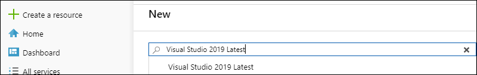

     on Windows 2019 (x64) selected")

2. Select the **Create** button.

3. Set the following configuration on the Basics tab:

    - **Subscription**: (Your Subscription) Select the subscription you are using for this hands-on lab.

    - **Resource Group**: Select the **Create new** link, and enter `intelligent-analytics` as the name of the new resource group.

    - **Virtual Machine Name**: Enter `LabVM`

    - **Region**: East US

    - **Availability Options**:  Leave the availability option as **No infrastructure redundancy required**

    - **Image**: Select **Visual Studio 2019 Community (latest release) on Windows Server 2019 (x64)**

    - **Size**: Select the **See all sizes** link, and choose **Standard D2s v3** or any other suitable size. 

    - **Username**: `demouser`

    - **Password**: (your password)

    - **Public inbound ports**: **Allow selected ports**

    - **Select inbound ports**: Select **RDP (3389)**.
    
    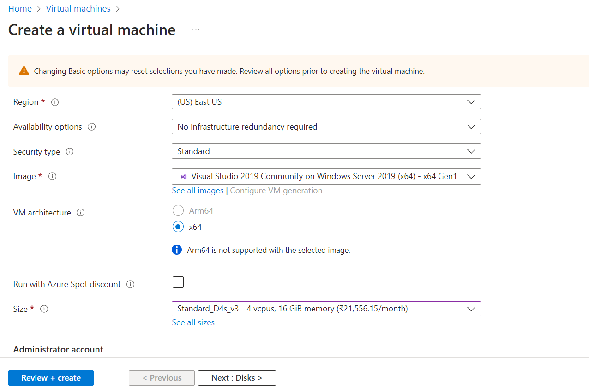
    
4. Set the following configuration on the Disks tab:

    - **OS disk type**: Select **Standard SSD**.

    - **Advanced** - Use managed disks: **Yes**

    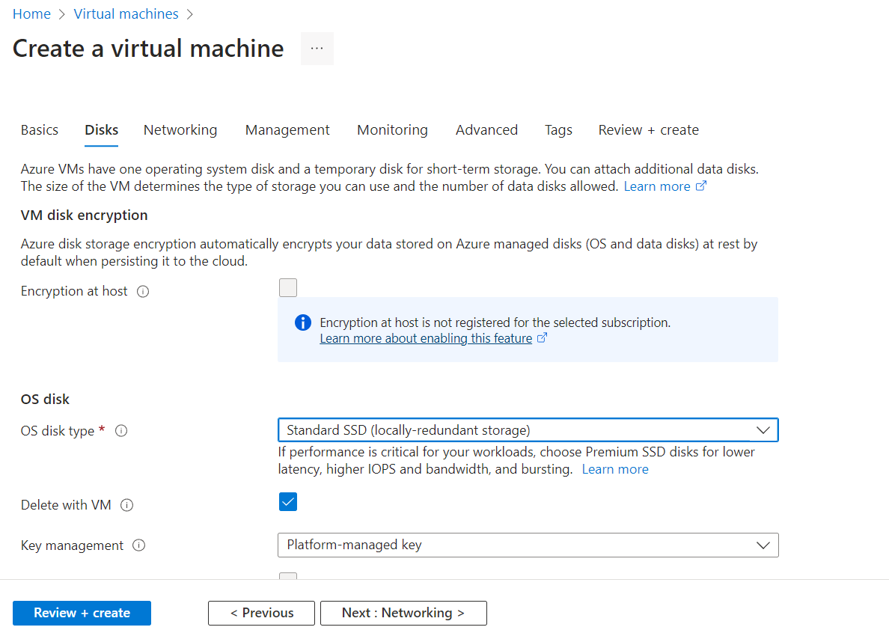

5. Select **Next: Networking**. Leave defaults. 

    

6. Leave defaults in all other tabs. 

    

7. Select the **Review + create** button.

    

8. Azure will validate your settings.  If everything is valid, then select **Create**.

    

### Task: Create a PowerBI user in Azure AD

1. Goto **Users** in Azure Active Directory.

    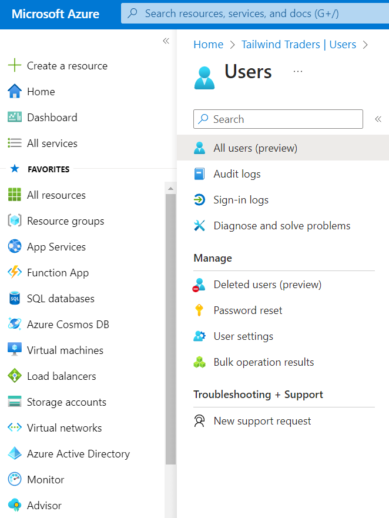
2. Click on Add user.
3. Name the user as **powerbi**

    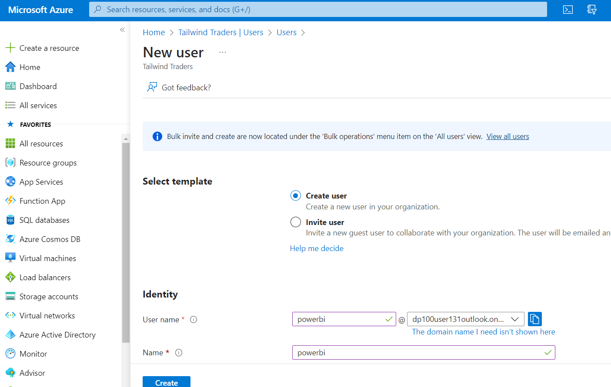
    
4. Fill up other necessary information.
5.  In **Groups and roles** section, Select **Global administrator** role for powerBI user.

    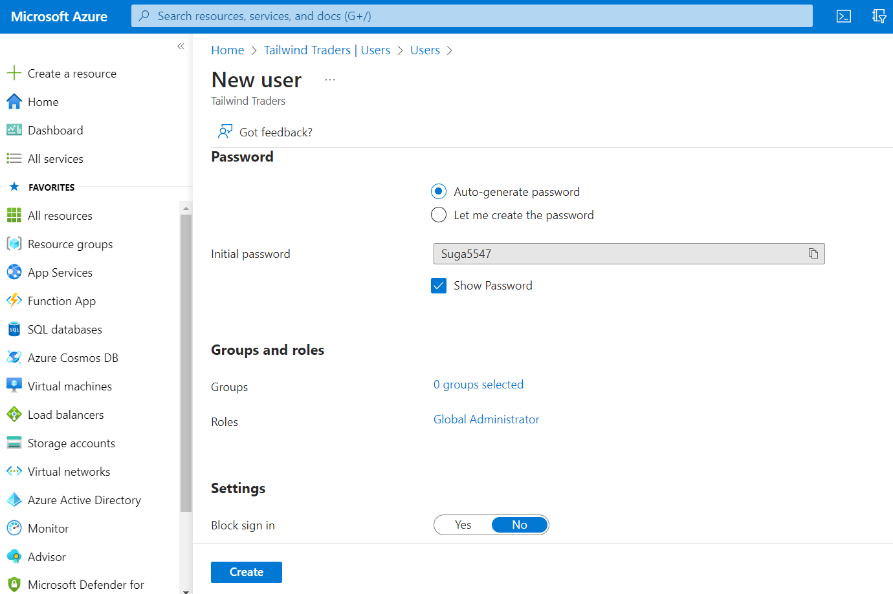
    
6.  Don't forget to copy the temp password of your powerbi user.
7.  Create the user. 

### Task: Give rights to powerBI user on the subscription. 

1. Seach for and goto **Subscriptions** page. Select your subscription. 

    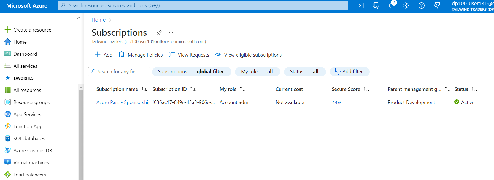
    
2. Click on Access control (IAM) -> Add -> Add role assignment 

    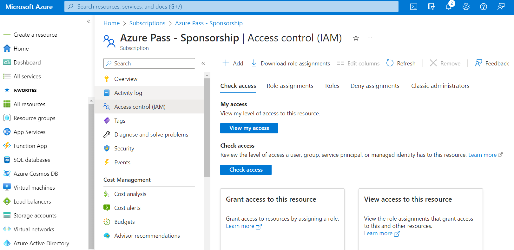
    
3. Select Role -> Owner -> Next

    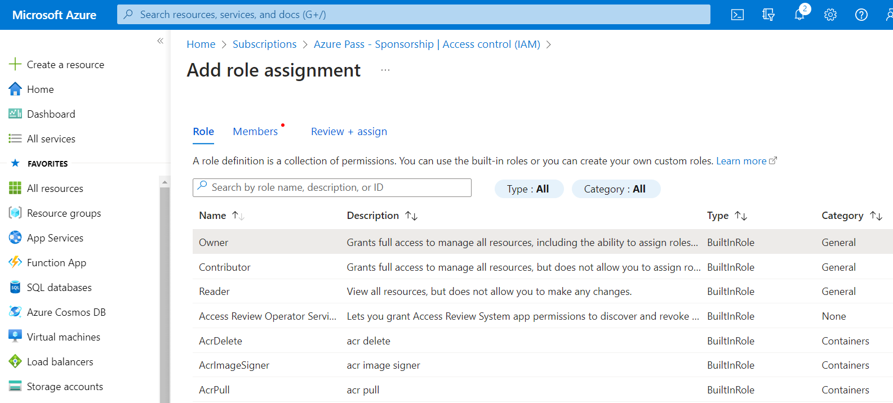
    
4. On members page click **+ Select members** -> Select powerbi user 

    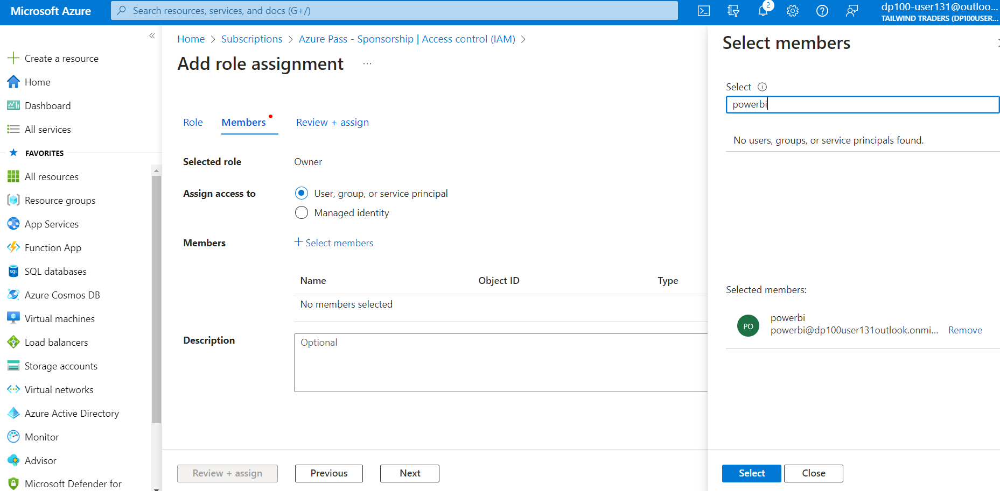

5. Click on Review & assign until it saves.  

    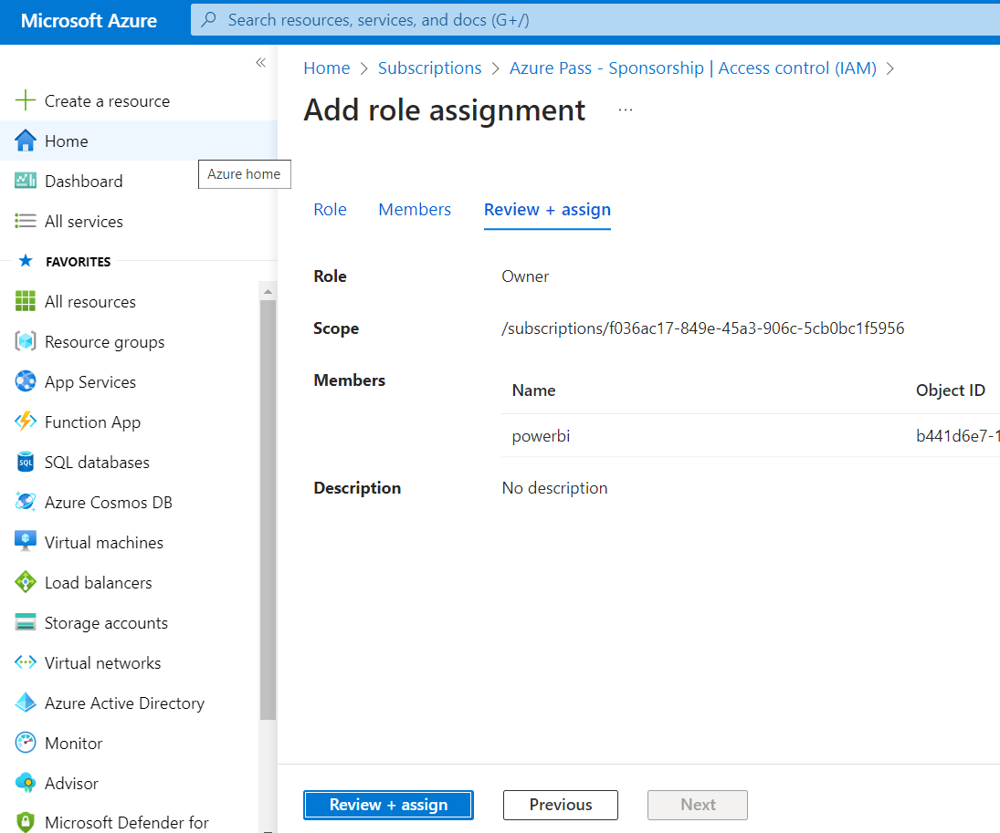
    
### Task: Create a Power BI account

1. Navigate to [Power BI sign up](https://powerbi.microsoft.com/) to create an account.

    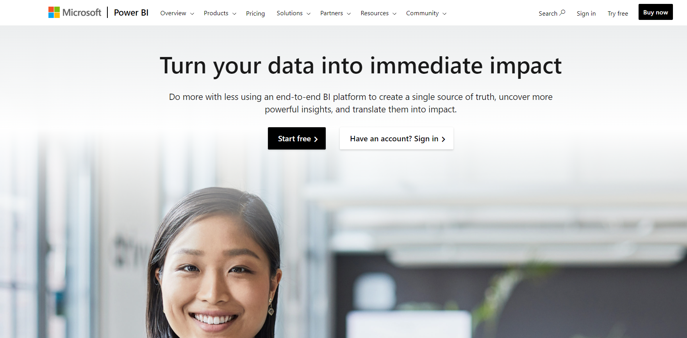
    
2. Use your powerBI user to complete the sign in. 
    
    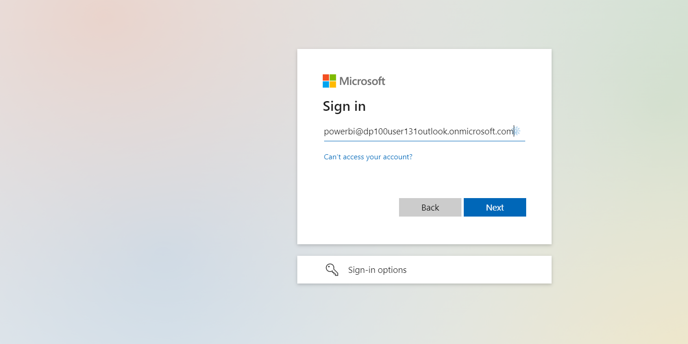
    
    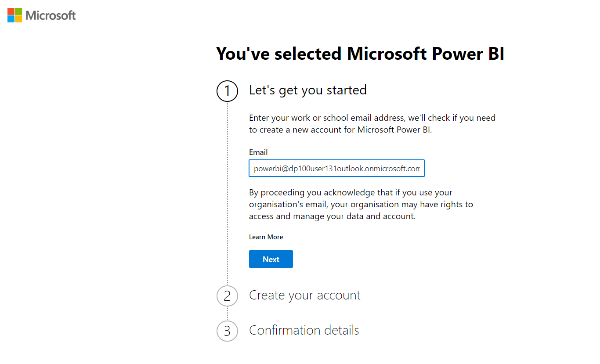

4. Create a 60 day free powerBI trial.   

    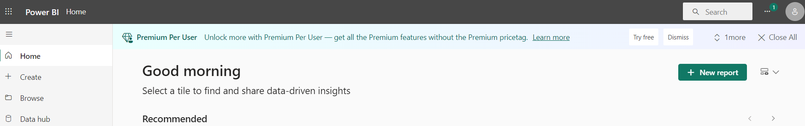

    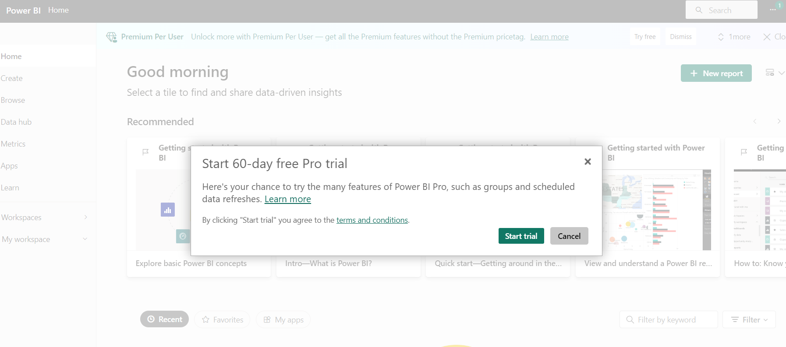
    
**Note:** Log into Azure portal with PowerBI user and do all the steps (Next lab) with this new user only. 

    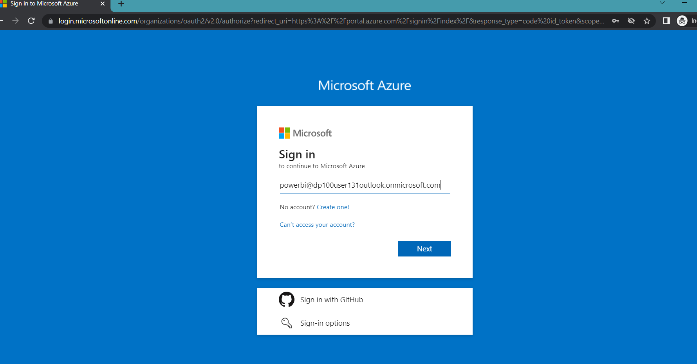

You should follow all steps provided *above* performing the next part of the Hands-on lab.
