<div class="MCWHeader1">
Intelligent analytics
</div>

<div class="MCWHeader2">
Hands-on lab step-by-step
</div>

<div class="MCWHeader3">
November 2019
</div>

Information in this document, including URL and other Internet Web site references, is subject to change without notice. Unless otherwise noted, the example companies, organizations, products, domain names, e-mail addresses, logos, people, places, and events depicted herein are fictitious, and no association with any real company, organization, product, domain name, e-mail address, logo, person, place or event is intended or should be inferred. Complying with all applicable copyright laws is the responsibility of the user. Without limiting the rights under copyright, no part of this document may be reproduced, stored in or introduced into a retrieval system, or transmitted in any form or by any means (electronic, mechanical, photocopying, recording, or otherwise), or for any purpose, without the express written permission of Microsoft Corporation.

The names of manufacturers, products, or URLs are provided for informational purposes only and Microsoft makes no representations and warranties, either expressed, implied, or statutory, regarding these manufacturers or the use of the products with any Microsoft technologies. The inclusion of a manufacturer or product does not imply endorsement of Microsoft of the manufacturer or product. Links may be provided to third party sites. Such sites are not under the control of Microsoft and Microsoft is not responsible for the contents of any linked site or any link contained in a linked site, or any changes or updates to such sites. Microsoft is not responsible for webcasting or any other form of transmission received from any linked site. Microsoft is providing these links to you only as a convenience, and the inclusion of any link does not imply endorsement of Microsoft of the site or the products contained therein.

© 2019 Microsoft Corporation. All rights reserved.

Microsoft and the trademarks listed at <https://www.microsoft.com/legal/intellectualproperty/Trademarks/Usage/General.aspx> are trademarks of the Microsoft group of companies. All other trademarks are property of their respective owners.

**Contents**

- [Intelligent analytics hands-on lab step-by-step](#intelligent-analytics-hands-on-lab-step-by-step)
  - [Abstract and learning objectives](#abstract-and-learning-objectives)
  - [Overview](#overview)
  - [Solution architecture](#solution-architecture)
  - [Requirements](#requirements)
  - [Exercise 1: Environment setup](#exercise-1-environment-setup)
    - [Task 1: Connect to the lab VM](#task-1-connect-to-the-lab-vm)
    - [Task 2: Download and open the ConciergePlus starter solution](#task-2-download-and-open-the-conciergeplus-starter-solution)
    - [Task 3: Create App Services](#task-3-create-app-services)
    - [Task 4: Provision Function App](#task-4-provision-function-app)
    - [Task 5: Provision Service Bus](#task-5-provision-service-bus)
    - [Task 6: Provision Event Hubs](#task-6-provision-event-hubs)
    - [Task 7: Provision Azure Cosmos DB](#task-7-provision-azure-cosmos-db)
    - [Task 8: Provision Azure Search](#task-8-provision-azure-search)
    - [Task 9: Create Stream Analytics job](#task-9-create-stream-analytics-job)
    - [Task 10: Start the Stream Analytics job](#task-10-start-the-stream-analytics-job)
    - [Task 11: Provision an Azure Storage account](#task-11-provision-an-azure-storage-account)
    - [Task 12: Provision Cognitive Services](#task-12-provision-cognitive-services)
  - [Exercise 2: Implement message forwarding](#exercise-2-implement-message-forwarding)
    - [Task 1: Implement the event processor](#task-1-implement-the-event-processor)
    - [Task 2: Configure the Chat Message Processor Function App](#task-2-configure-the-chat-message-processor-function-app)
      - [Event Hub connection string](#event-hub-connection-string)
      - [Event Hub name](#event-hub-name)
      - [Storage account](#storage-account)
      - [Service Bus connection string](#service-bus-connection-string)
      - [Chat topic](#chat-topic)
      - [Text Analytics API settings](#text-analytics-api-settings)
  - [Exercise 3: Configure the Chat Web App settings](#exercise-3-configure-the-chat-web-app-settings)
    - [Task 1: Event Hub connection String](#task-1-event-hub-connection-string)
    - [Task 2: Event Hub name](#task-2-event-hub-name)
    - [Task 3: Service Bus connection String](#task-3-service-bus-connection-string)
    - [Task 4: Chat topic path and chat request topic path](#task-4-chat-topic-path-and-chat-request-topic-path)
  - [Exercise 4: Deploying the App Services](#exercise-4-deploying-the-app-services)
    - [Task 1: Publish the ChatMessageSentimentProcessor Function App](#task-1-publish-the-chatmessagesentimentprocessor-function-app)
    - [Task 2: Publish the ChatWebApp](#task-2-publish-the-chatwebapp)
    - [Task 3: Testing hotel lobby chat](#task-3-testing-hotel-lobby-chat)
  - [Exercise 5: Add intelligence](#exercise-5-add-intelligence)
    - [Task 1: Implement sentiment analysis](#task-1-implement-sentiment-analysis)
    - [Task 2: Implement linguistic understanding](#task-2-implement-linguistic-understanding)
    - [Task 3: Re-deploy and test](#task-3-re-deploy-and-test)
  - [Exercise 6: Create Logic App for sending SMS notifications](#exercise-6-create-logic-app-for-sending-sms-notifications)
    - [Task 1: Create Free Twilio account](#task-1-create-free-twilio-account)
    - [Task 2: Provision Logic App](#task-2-provision-logic-app)
    - [Task 3: Configure staff notifications](#task-3-configure-staff-notifications)
    - [Task 4: Add negative chat messages to trigger staff notifications](#task-4-add-negative-chat-messages-to-trigger-staff-notifications)
  - [Exercise 7: Building the Power BI dashboard](#exercise-7-building-the-power-bi-dashboard)
    - [Task 1: Provision Power BI](#task-1-provision-power-bi)
    - [Task 2: Create the static dashboard](#task-2-create-the-static-dashboard)
    - [Task 3: Create the real-time dashboard](#task-3-create-the-real-time-dashboard)
    - [Task 4: Add a trending sentiment chart to the dashboard](#task-4-add-a-trending-sentiment-chart-to-the-dashboard)
  - [Exercise 8: Enabling search indexing](#exercise-8-enabling-search-indexing)
    - [Task 1: Verifying message archival](#task-1-verifying-message-archival)
    - [Task 2: Creating the index and indexer](#task-2-creating-the-index-and-indexer)
    - [Task 3: Update the Chat Web App web.config](#task-3-update-the-chat-web-app-webconfig)
    - [Task 4: Re-publish web app](#task-4-re-publish-web-app)
  - [Exercise 9: Add a bot using Bot service and QnA Maker](#exercise-9-add-a-bot-using-bot-service-and-qna-maker)
    - [Task 1: Create a QnA service instance in Azure](#task-1-create-a-qna-service-instance-in-azure)
    - [Task 2: Create a QnA bot](#task-2-create-a-qna-bot)
    - [Task 3: Embed the bot into your web app](#task-3-embed-the-bot-into-your-web-app)
  - [After the hands-on lab](#after-the-hands-on-lab)
    - [Task 1: Delete the resource group](#task-1-delete-the-resource-group)

# Intelligent analytics hands-on lab step-by-step

## Abstract and learning objectives

This hands-on lab is designed to provide exposure to many of Microsoft's transformative line of business applications built using Microsoft advanced analytics. The goal is to show an end-to-end solution, leveraging many of these technologies, but not necessarily doing work in every component possible.

By the end of the hands-on lab, you will be more confident in the various services and technologies provided by Azure, and how they can be combined to build a real-time chat solution that is enhanced by Cognitive Services.

## Overview

First Up Consultants specialize in building software solutions for the hospitality industry. Their latest product is an enterprise mobile/social chat product called Concierge+ (aka ConciergePlus). The mobile web app enables guests to easily stay in touch with the concierge and other guests, enabling greater personalization and improving their experience during their stay. Sentiment analysis is performed on top of chat messages as they occur, enabling hotel operators to keep tabs on guest sentiments in real-time.

## Solution architecture

Below is a diagram of the solution architecture you will build in this lab. Please study this carefully so you understand the whole of the solution as you are working on the various components.


Messages are sent from browsers running within laptop or mobile clients via Web Sockets to an endpoint running in an Azure Web App. Chat messages received by the Web App are sent to an Event Hub where they are temporarily stored. An Azure Function picks up the chat messages and applies sentiment analysis to the message text (using the Text Analytics API), as well as contextual understanding (using LUIS). The function forwards the chat message to an Event Hub used to store messages for archival purposes, and to a Service Bus Topic which is used to deliver the message to the intended recipients. A Stream Analytics Job provides a simple mechanism for pulling the chat messages from the second Event Hub and writing them to Cosmos DB for archiving, a Service Bus queue for negative sentiment notifications, and to Power BI for visualization of sentiment in real-time as well as trending sentiment. A Logic App is triggered when messages are added to a Service Bus queue, and sends SMS messages to hotel staff when negative guest sentiment is detected in the chat. An indexer runs atop Cosmos DB that updates the Azure Search index which provides full text search capability. Messages in the Service Bus Topic are pulled by Subscriptions created in the Web App and running on behalf of each client device connected by Web Sockets. When the Subscription receives a message, it is pushed via Web Sockets down to the browser-based app and displayed in a web page. Bot Services hosts a bot created using QnA maker, which automatically answers simple questions asked by site visitors.

## Requirements

- Microsoft Azure subscription must be pay-as-you-go or MSDN.
  - Trial subscriptions will not work.
- A virtual machine configured with:
  - Visual Studio Community 2019 or later.
  - Azure SDK 2.9 or later (Included with Visual Studio 2019).

## Exercise 1: Environment setup

Duration: 60 minutes

Synopsis: The following section walks you through the manual steps to provision the services required in the [Azure portal](https://portal.azure.com).  First Up Consultants have provided a starter solution for you. They have asked you to use this as the starting point for creating the Concierge Plus intelligent chat solution in Azure.

### Task 1: Connect to the lab VM

If you are already connected to your Lab VM, skip to Step 6.

1. In the [Azure portal](https://portal.azure.com), and select Resource groups from the left-hand menu, then enter intelligent-analytics into the filter box, and select the resource group from the list.

    

2. Next, select **LabVM** from the list of available resources.

    

3. On the LabVM blade, select **Connect** from the top menu, which will download an RDP file.

    

4. Open the downloaded RDP file.

5. Select Connect on the Remote Desktop Connection dialog.

    

6. Enter the following credentials (or the non-default credentials if you changed them):

    - **Username**: demouser

    - **Password**: Password.1!!

    

7. Select Yes to connect, if prompted that the identity of the remote computer cannot be verified.

    

8. Once logged in, launch the **Server Manager**. This should start automatically, but you can access it via the Start menu if it does not.

9. Select Local Server, then select **On** next to **IE Enhanced Security Configuration**.

    

10. In the Internet Explorer Enhanced Security Configuration dialog, select **Off under Administrators**, then select **OK**.

    

11. Close the Server Manager.

12. Allow for downloading files.  Open **Internet Explorer**.
    - Type F10.  The menu should be displayed.
    - Go to **Tools**.

        
    - Select **Internet Options**
    - Select the **Security** tab and the **Custom Level** for the **Internet**

    
    - Scroll down to **File download** and enable.

    

13. Now you can download files from the Internet. Download and install Google Chrome.

### Task 2: Download and open the ConciergePlus starter solution

1. From your Lab VM, download the starter project by downloading a .zip copy of the Intelligent analytics GitHub repo.

2. In a web browser, navigate to the [Intelligent analytics MCW repo](https://github.com/Microsoft/MCW-Intelligent-analytics).

3. On the repo page, select **Clone or download**, then select **Download ZIP**.

    

4. Unzip the contents of the downloaded ZIP file to the folder **C:\\ConciergePlus**\\.

   >**Note**: Make sure to extract to this exact path. If you extract to a longer directory path, you will hit a Windows max 260 character path limit when you try to build the Visual Studio solution. You will not be able to download the NuGet packages. Keep the solution directory path short.

     Folders window')

5. Open **ConciergePlusSentiment.sln** in the `C:\ConciergePlus\Hands-on lab\lab-files\starter-project\` folder with Visual Studio 2019.

6. Sign in to Visual Studio or select create account, if prompted.

7. If presented with the Start with a familiar environment dialog, select Visual C\# from the Development Settings drop down list, and select Start Visual Studio.

    

8. If the Security Warning window appears, uncheck Ask me for every project in this solution, and select OK.

    

    

>**Note**: If you attempt to build the solution at this point, you will see many build errors. This is intentional. You will correct these in the exercises that follow.

>**Note**: Visual Studio Installer will show the installed version of Visual Studio and if the Azure SDK is installed. If the Azure SDK is missing, go back to the **Before the HOL** and make sure you created the correct VM. Updating Visual Studio manually may install components that may not work with the lab.

### Task 3: Create App Services

In these steps, you will provision a Web App within a single App Service Plan.

1. Sign in to the Azure Portal (<https://portal.azure.com>).

2. Select **+Create a resource**, then select Web and finally select **Web App**. Select the **Create** button.

    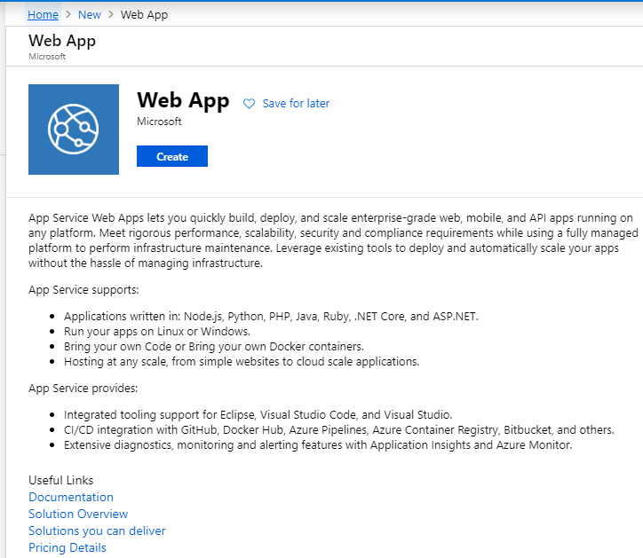

3. On the Create Web App blade, enter the following:

    - **Subscription**: Select your subscription.
    - **Resource Group**: Select Use existing, and select the **intelligent-analytics** resource group created previously.
    - **Name**: Provide **a unique name** that is indicative of this resource being used to host the Concierge+ chat website (e.g., conciergepluschatapp + (namespace)).
    - **Runtime stack**: ASP.NET 4.7
    - **Publish**: Choose **Code** option.
    - **OS**: Windows
    - **Region**: Choose a region close to you.
    - **App Service plan**: azure-scenario-experience (S1)

    - Select **Review and Create** to provision both Web App and the App Service Plan. Select the **Create** button.

4. When provisioning completes, navigate to your new Web App in the portal by selecting on **App Services**, and then selecting your web app.

    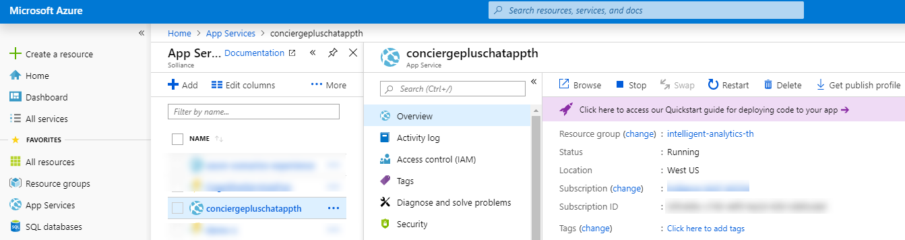

5. On the App Service blade, select **Configuration** and then select the **General settings** menu item.

    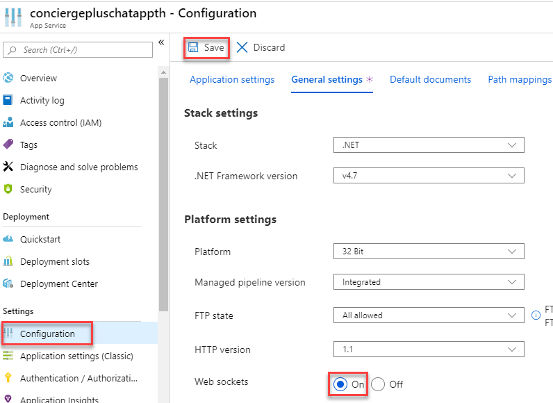

6. Select the toggle for **Web Sockets** to **On**.

   >**Note**: Failure to complete this step will not allow the Javascript client to communicate with the web application and receive continuous data exchange.

7. Select **Save**.

### Task 4: Provision Function App

In this section, you will provision a Function App that will be used as the EventProcessorHost for processing and enriching Event Hubs data.

1. Select **+Create a resource, search for Function App**.

    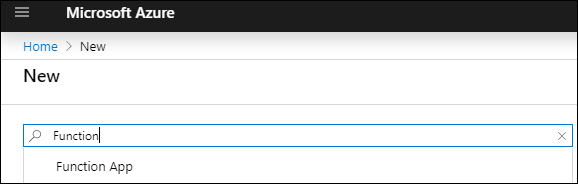

2. On the Create Function App blade, enter the following:

    - **App Name**: Provide **a unique name** that is indicative of this resource being used to process chat messages (e.g., chatprocessor).

    - **Subscription**: Select your subscription.

    - **Resource Group**: Select Use existing, and select the **intelligent-analytics** resource group created previously.

    - **OS**: Windows

    - **Plan Type**: Select **Consumption**.

    - **Location**: Select the location you used for the resource group created previously.

    - **Runtime Stack**:  Select **.NET Core**.

    - **Storage**: Select **Create new** and accept the generated name.

    - **Application Insights**: **On**

    - Select **Create** to provision the Function App.

    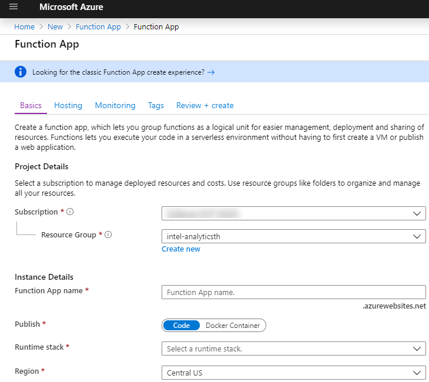

### Task 5: Provision Service Bus

In this section, you will provision a Service Bus Namespace and Service Bus Topic.

1. Continuing in the [Azure portal](https://portal.azure.com), select **+Create a resource**.

2. Search for **Service Bus** and select the **Create** button.

    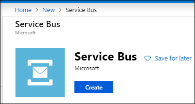

3. On the Create namespace blade enter the following:

    - **Name**: Provide a unique name for the namespace (e.g., awhotel-namespace). Namespace could be your initials.

    - **Pricing tier**: Select Standard.

    - **Subscription**: Select the subscription you are using for this hands-on lab.

    - **Resource Group**: Choose Use existing and select the intelligent-analytics resource group.

    - **Location**: Select the location you are using for resources in this hands-on lab.

      

4. Select **Create**.

5. Once provisioning completes, navigate to your new Service Bus in the portal by choosing Resource Groups in the left menu, the selecting **intelligent-analytics**, and selecting your Service Bus.

    

6. On the Overview blade, select on Topic under Entities on the left-hand side of the blade.

    

7. Add a new Topic by selecting +Topic.

    

8. On the Create topic blade, enter the following:

    - **Name**: Enter **awhotel**. This represents that this topic will handle the messages for a particular hotel.

    - **Max topic size**: Leave set to 1 GB.

    - **Message time to live**: Set to 1 day.

    - **Enable partitioning**: Uncheck this checkbox. Chat will not function properly if this is left checked.

      

9. Select **Create**.

10. Next, select **Queues** under Entities on the left-hand menu, and then select **+Queue**.

11. In the Create queue dialog, enter the following:

    - **Name**: awhotelstaffnotifications
    - **Max topic size**: Leave set to 1 GB.
    - **Message time to live**: Set to 1 day.
    - **Enable partitioning**: Uncheck this checkbox.

        

12. Select **Create**.

13. Navigate back to the **Service Bus namespace** in the Azure Portal

    - Select **Shared access policies** within the left menu, under Settings.

    - In the Shared access policies, you are going to create a new policy that the ChatConsole can use to retrieve messages. Select +Add.

    

    - For the New Policy Name, enter **ChatConsole**.

    - In the list of claims, select **Manage, Send, and Listen**.

    

    - Select **Create**.

### Task 6: Provision Event Hubs

In this task, you will create a new Event Hubs namespace and instance.

1. In the [Azure portal](https://portal.azure.com), select **+Create a resource**, then search for **Event Hubs**.

    

2. On the Create namespace blade enter the following:

    - **Name**: Provide a unique name for the namespace (e.g., awhotel-events-namespace).

    - **Pricing tier**: Select Standard.

    - **Subscription**: Select the subscription you are using for this hands-on lab.

    - **Resource Group**: Choose Use existing and select the intelligent-analytics resource group.

    - **Location**: Select the location you are using for resources in this hands-on lab.

    - **Throughput Units**: Leave at 1.

    - **Enable auto-inflate**: Uncheck.

    - Select **Create** to provision the Event Hubs namespace.

      

3. When provisioning completes, navigate to your new Event Hub namespace in the portal by choosing Resource Groups in the left menu. Select intelligent-analytics followed by your Event Hub.

    

4. On the Overview blade, select +Event Hub to add a new Event Hub.

    

5. On the Create Event Hub blade, enter the following:

    - **Name**: Enter awchathub.

    - **Partition Count**: Set to the **max value of 32**. This will enable you to significantly scale up the number of downstream processors on the Event Hub, where each partition consumer (as handled by the EventProcessorHost) can reach up to 1 Throughput Unit per partition should the need arise. You cannot change this value later.

    - **Message Retention**: Leave set to 1.

    - **Capture**: Leave set to Off.

    - Leave the remaining values as their defaults.

    - Select **Create**.

      

6. Repeat steps listed 5 to create another Event Hub. This one will store messages for archival and be processed by Stream Analytics. Name it awchathub2. If you select the **Event Hubs** menu item to display the list of event hubs, you should see the following:

    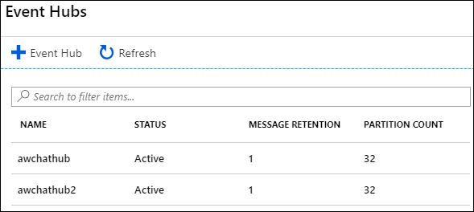

### Task 7: Provision Azure Cosmos DB

In this section, you will provision an Azure Cosmos DB account, a DocumentDB Database, and a DocumentDB collection that will be used to collect all the chat messages.

1. In the [Azure portal](https://portal.azure.com), select **+Create a resource**.  Search for **Azure Cosmos DB**.

    

2. On the Azure Cosmos DB blade, enter the following:
    - **Subscription**: Select the subscription you are using for this hands-on lab.

    - **Resource Group**: Choose Use existing and select the intelligent-analytics resource group.

    - **Account Name**: Provide a unique name for the Azure Cosmos DB account (e.g., awhotelcosmosdb + namespace).

    - **API**: Select Core(SQL).

    - **Location**: Select the region you are using for resources in this hands-on lab.
  
    >**Note**: You have to pick a different region instance in order for the Geo-Redundancy options to be enabled, e.g. US-WEST vs US-WEST2.

    - **Enable geo-redundancy**: Ensure this is enabled.

    - **Multi-region Writes**: Ensure this is disabled.

    - Select awhotelcosmosdb to provision the Azure Cosmos DB instance.

      

    - Select the **Review + create** button and then the **Create** button.

3. When the provisioning completes, navigate to your new Azure Cosmos DB account in the portal.

4. Select the Overview blade, then select **+Add Container**.

    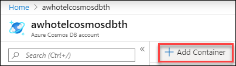

5. On the Add Container blade, enter the following:

    - **Database id**: Create new. Enter awhotels.

    - **Container Id**: Enter messagestore.

    - **Partition Key**: Enter a partition key such as **/username**.
        >**Note**: Pick a field in this schema.  Otherwise, you will have no documents in the Cosmo DB container. Below is a sample of the messages stored in the Cosmo DB at a later part in the lab.

        

    - **Throughput**: Set to 400.

    - Select **OK** to add the container.

6. Add another container with the following:

    - **Database id**: Enter existing database id **awhotels**.

    - **Container Id**: Enter **sentiment**.

    - **Partition Key**: Enter a partition key such as **/username**.

    - **Throughput**: Set to 400.

    - Select **OK** to add the container.

    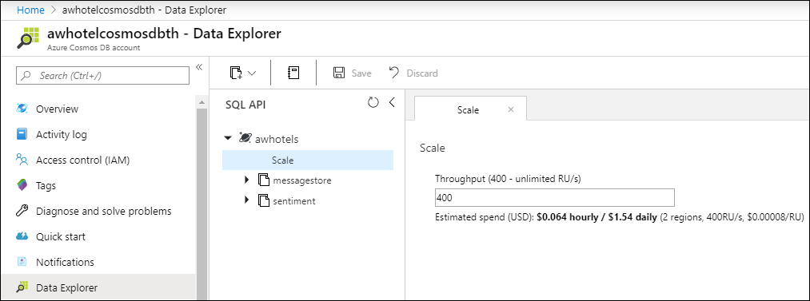

### Task 8: Provision Azure Search

In this section, you will create an Azure Search instance.

1. Select **+Create a resource**, then search for **Search**.  Choose the **Create** button.

    

2. On the New Search Service blade, enter the following:

    - **URL**: Provide a **unique name** for the search service (e.g., conciergeplusapp).

    - **Subscription**: Select the subscription you are using for this hands-on lab.

    - **Resource Group**: Choose Use existing and select the intelligent-analytics resource group.

    - **Location**: Select the location you are using for resources in this hands-on lab, or the next closest location if your location is unavailable in the list.

    - **Pricing Tier**: Select Basic.

    - Select **Create**.

      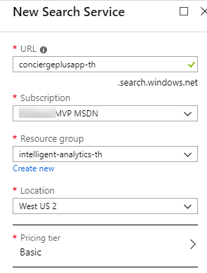

### Task 9: Create Stream Analytics job

In this section, you will create the Stream Analytics Job that will be used to read chat messages from the Event Hub and write them to the Azure Cosmos DB.

1. Select **+Create a resource**, the search for **Stream Analytics** **job**.  Choose the **Create** button.

2. On the New Stream Analytics Job blade, enter the following:

    - **Job Name**: Enter MessageLogger.

    - **Subscription**: Select the subscription you are using for this hands-on lab.

    - **Resource Group**: Choose Use existing and select the intelligent-analytics resource group.

    - **Location**: Select the location you are using for resources in this hands-on lab.

    - **Hosting environment**: Select Cloud.

    - Select **Create** to provision the new Stream Analytics job.

      

3. When provisioning completes, navigate to your new Stream Analytics job in the portal by selecting Resource Groups in the left menu, and selecting intelligent-analytics, then selecting your Stream Analytics Job.

    

4. Select **Inputs** on the left-hand menu, under Job Topology.

    

5. On the Inputs blade, select **+Add stream input** and then select **Event Hub**.

    

6. On the New Input blade, enter the following:

    - **Input Alias**: Set the value to **eventhub**.

    - Choose **Select Event Hub from your subscriptions**.

    - **Subscription**: Choose the same subscription you have been using thus far.

    - **Event Hub namespace**: Choose the Namespace which contains **your Event Hubs instance** (e.g., awhotelevents-namespace).

    - **Event hub name**: Choose the second Event Hub instance you created (**awchathub2**).

    - **Event hub policy name**: Leave as **RootManageSharedAccessKey**.

    - **Event hub consumer group**: Leave this **blank** (\$Default consumer group will be used).

    - **Event serialization format**: Leave as **JSON**.

    - **Encoding**: Leave as **UTF-8**.

    - **Event compression type**: Leave set to **None**.

    - Select **Save**.

      

7. Now, select **Outputs** from the left-hand menu, under Job Topology.

    

8. In the Outputs blade, select **+Add**, then select **Cosmos DB**.

    

9. On the Cosmos DB New output blade, enter the following:

    - **Output alias**: Enter **cosmosdb**.

    - **Import Option**: Leave set to Select Cosmos DB from your subscriptions.

    - **Subscription**: Choose the same subscription you have been using thus far.

    - **Account Id**: Select your Account id (e.g., awhotel-cosmosdb).

    - **Database**: Select your database, **awhotels**.

    - **Container name pattern**: Set to the name of your messages collection, **messagestore**.

    - **Document Id**: Set to **messageid** (all lowercase).

    - Select **Save**.

      

10. Create another Output, this time for **Service Bus queue**.

    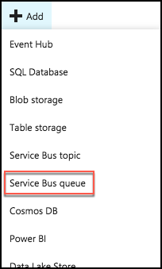

11. On the Service Bus queue New output blade, enter the following:

    - **Output alias**: Enter staffnotificationqueue.

    - Choose **Select queue from your subscriptions**.

    - **Subscription**: Select the subscription you are using for this hands-on lab.

    - **Service Bus namespace**: Select the awhotel-sb namespace.

    - **Queue name**: Choose Use existing and select awhotelstaffnotifications.

    - **Queue policy name**: Select ChatConsole.

    - **Event serialization format**: Leave as JSON.

    - **Encoding**: Leave as UTF-8.

    - **Format**: Leave set to Line separated.

        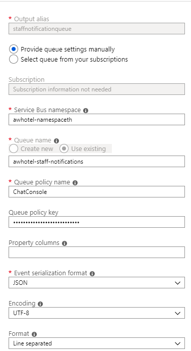

12. Select **Save**.

13. Create another Output, this time for **Power BI**.

    

    Select **Authorize**. This will authorize the connection to your Power BI account. When prompted in the popup window, enter the account credentials you used to create your Power BI account in the Before the Hands-on Lab exercise. You may have to enter your Username and Password.

14. On the New output blade, enter the following:

    - **Output alias**: Enter **powerbi**.

    - **Group workspace**: Authorize connection to load workspaces.

    - **Dataset Name**: Set to **Messages**.

    - **Table Name**: Set to **Messages**.
  
    - **Authentication Mode**: Select **User token**.

      

        If the authorization has succeeded, then you should see the workspaces available.

      

    - Select the Save button.

15. Create one final Output for **Power BI**.

    

16. On the New output blade, enter the following:

    - **Output alias**: Enter **trendingsentiment**.

    - **Group workspace**: My workspace

    - **Dataset Name**: Set to **TrendingSentiment**.

    - **Table Name**: Set to **TrendingSentiment**.

    - **Authentication Mode**: Select **User token**.

    Select **Authorize** (if not already authorized). This will authorize the connection to your Power BI account. When prompted in the popup window, enter the account credentials you used to create your Power BI account in the Before the Hands-on Lab exercise. You may have to enter your Username and Password.

    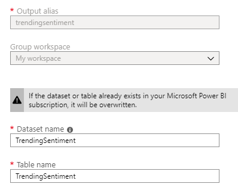

17. Select **Save**.

18. Next, select **Query** from the left-hand menu, under Job Topology.

    

19. In the query text box, enter the following query for Cosmos DB:

    ```sql
    SELECT
    *
    INTO
    cosmosdb
    FROM
    eventhub
    ```

20. Select Save, and Yes when prompted with the confirmation.

    

21. Now, modify your query to add the following Service Bus queue query. Enter or paste the following code below the first query:

    ```sql
    SELECT *
    INTO [staffnotificationqueue]
    FROM eventhub
    WHERE score < 0.1
    ```

22. Now, modify your query to add the following Power BI query. Enter or paste the following code below the Service Bus query:

    ```sql
    SELECT
    *
    INTO
    powerbi
    FROM
    eventhub
    ```

23. Finally, add the following query below that aggregates the average sentiment into 5-minute tumbling windows:

    ```sql
    SELECT AVG(score) AS Average, System.TimeStamp AS Snapshot
    INTO [trendingsentiment]
    FROM eventhub
    GROUP BY TumblingWindow(minute, 5)
    ```

24. Your query text should now look like the following:

    ```sql
    SELECT
    *
    INTO
    cosmosdb
    FROM
    eventhub

    SELECT *
    INTO [staffnotificationqueue]
    FROM eventhub
    WHERE score < 0.1

    SELECT
    *
    INTO
    powerbi
    FROM
    eventhub

    SELECT AVG(score) AS Average, System.TimeStamp AS Snapshot
    INTO [trendingsentiment]
    FROM eventhub
    GROUP BY TumblingWindow(minute, 5)
    ```

25. Select **Save** again, and select **Yes** when prompted with the confirmation.

    

### Task 10: Start the Stream Analytics job

1. Navigate to your Stream Analytics job in the portal by selecting Resource Groups in the left menu, and selecting intelligent-analytics, then selecting your Stream Analytics Job.

    

2. From the Overview blade, select **Start**.

    

3. In the Start job blade, select **Now** (the job will start processing messages from the current point in time onward).

    

4. Select **Start**.

5. Allow your Stream Analytics Job a few minutes to start. Once the Job starts it will move to a state of Running.

    

### Task 11: Provision an Azure Storage account

The EventProcessorHost requires an Azure Storage account that it will use to manage its state among multiple instances. In this section, you create that Storage account.

1. In the [Azure portal](https://portal.azure.com), select **+Create a resource, Storage, the select Storage account**.  Select the Create button.

2. In the Create storage account blade, enter the following:

    - **Subscription**: Select the subscription you are using for this hands-on lab.

    - **Resource Group**: Choose Use existing and select the intelligent-analytics resource group.

    - **Storage account name**: Provide a unique name for the account e.g., awhotelchatstore + (namespace).

    - **Location**: Select the location you are using for resources in this hands-on lab.

    - **Performance**: Set to Standard.

    - **Account kind**: StorageV2 (general purpose v2)

    - **Access tier**: Hot

    - **Deployment model**: Leave Resource Manager selected.

    - **Replication**: Set to Locally Redundant Storage (LRS).

        Go to the Advanced tab.

    - **Secure transfer required**: Select Disabled.

    - Select **Review + create**.  Select **Create**.

      

### Task 12: Provision Cognitive Services

To provision access to the Text Analytics API (which provides sentiment analysis features), you will need to provision a Cognitive Services account.

1. In the [Azure portal](https://portal.azure.com), select +Create a resource, search for Text Analytics.

    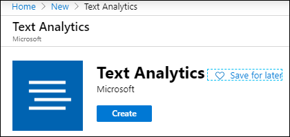

2. On the Create blade, enter the following:

    - **Name**: Enter a unique name like awhotels-sentiment.

    - **Subscription**: Select the subscription you are using for this hands-on lab.

    - **Location**: Select the location you are using for resources in this hands-on lab.

    - **Pricing tier**: Choose F0.

    - **Resource Group**: Choose Use existing and select the intelligent-analytics resource group.

    - Check the box to confirm you have read and understood the notice.

      

3. Select **Create**.

4. When it finishes provisioning, browse to the newly created cognitive service by selecting Resource Groups in the left menu, then select the **intelligent-analytics** resource group, and selecting the Cognitive Service, **awhotels-sentiment**.

5. Acquire the key for the API by selecting Keys on the left-hand menu.

    

6. Copy the value for Key 1, and paste it into a text editor, such as Notepad, for later reference in the ConciergePlusSentiment solution in Visual Studio.

    

7. Select **+Create a resource**, select **Language Understanding**.  Repeat steps 1-6: Create blade:

    - **Name**: **luis-api**.
  
    - **Authoring location**: Enter a region close to you.
  
    - **Runtime location**: Enter a region close to you.
  
    - Copy **Key 1** for LUIS to your Notepad instance.

      

8. Verify that you have captured the two API keys for later reference in this lab.

## Exercise 2: Implement message forwarding

Duration: 45 minutes

In this section, you will implement the message forwarding from the ingest Event Hub instance to an Event Hub instance and a Service Bus Topic. You will also configure the web-based components, which consist of two parts: The Web App UI and the Function App that runs the EventProcessorHost.

### Task 1: Implement the event processor

1. On your Lab VM, open the `ConciergePlusSentiment.sln` file that you downloaded using Visual Studio, if it is not already open.

2. Open `ProcessChatMessage.cs` (found within the `ChatMessageSentimentProcessorFunction` project in the Solution Explorer).

    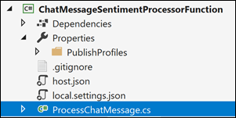

3. Scroll down to the Run method. This method represents the heart of the message processing logic utilized by the Event Processor Host running in an Azure function. It is provided a collection of EventData instances, each of which represent a chat message in the solution.

    

4. Locate TODO: 1 and replace the lines that follow the comment with the following:

    ```csharp
    //TODO: 1.Extract the JSON payload from the binary message
    var eventBytes = eventData.GetBytes();
    var jsonMessage = Encoding.UTF8.GetString(eventBytes);
    ```

5. Locate TODO: 2 and replace the line that follows with:

    ```csharp
    //TODO: 2.Deserialize the JSON message payload into an instance of MessageType
    var msgObj = JsonConvert.DeserializeObject<MessageType>(jsonMessage);
    log.Info(msgObj.message);
    ```

6. Locate TODO: 3 and replace the line that follows with:

    ```csharp
    //TODO: 3. Create a BrokeredMessage (for Service Bus) and EventData instance (for EventHubs) from source message body
    var updatedEventBytes = Encoding.UTF8.GetBytes(JsonConvert.SerializeObject(msgObj));
    BrokeredMessage chatMessage = new BrokeredMessage(updatedEventBytes);
    EventData updatedEventData = new EventData(updatedEventBytes);
    ```

7. Locate TODO: 4 and replace the lines that follow with:

    ```csharp
    //TODO: 4.Copy the message properties from source to the outgoing message instances
    foreach (var prop in eventData.Properties)
    {
        chatMessage.Properties.Add(prop.Key, prop.Value);
        updatedEventData.Properties.Add(prop.Key, prop.Value);
    }
    ```

8. Locate TODO: 5 and replace the line that follows with:

    ```csharp
    //TODO: 5.Send chat message to Topic
    await outputServiceBus.AddAsync(chatMessage);
    Console.WriteLine("Forwarded message to topic.");
    ```

9. Locate TODO: 6 and replace the line that follows with:

    ```csharp
    //TODO: 6.Send chat message to next EventHub (for archival)
    await outputEventHub.AddAsync(updatedEventData);
    Console.WriteLine("Forwarded message to event hub.");
    ```

10. Save the file.

### Task 2: Configure the Chat Message Processor Function App

1. Navigate to your Function App in the [Azure portal](https://portal.azure.com). You can find it by opening your intelligent-analytics Resource Group and looking through the list of resources.

2. Select the **Configuration** link in the Overview blade of the Function App. Choose the **Application settings** link.

    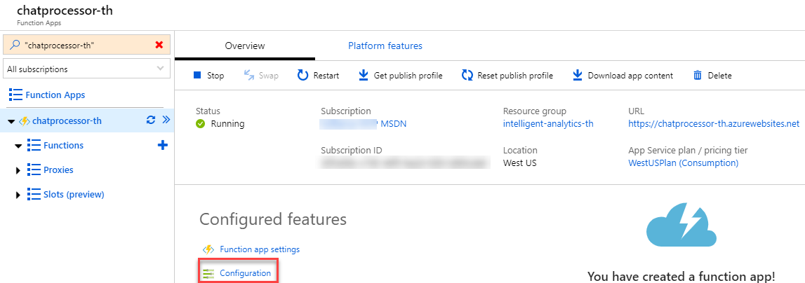

3. You will add the following application settings. The following sections walk you through the process of retrieving the values for these settings:

    ```javascript
    eventHubConnectionString
    sourceEventHubName
    destinationEventHubName
    storageAccountName
    storageAccountKey
    serviceBusConnectionString
    chatTopicPath
    textAnalyticsBaseUrl
    textAnalyticsAccountName
    textAnalyticsAccountKey
    ```

#### Event Hub connection string

The connection string required by the ChatMessageSentimentProcessor is different from the typical Event Hub consumer, because not only does it need Listen permissions, but it also needs Send and Manage permissions on the Service Bus Namespace (because it receives messages, as well as creates Subscriptions).

1. To get the **eventHubConnectionString**, navigate to the Event Hub namespace in the Azure Portal by selecting Resource Groups on the left menu, then selecting the intelligent-analytics resource group, and selecting your Event Hub from the list of resources.

    

2. Select Shared access policies, under Settings, within the left-hand menu.

3. In the Shared access policies, you are going to create a new policy that the **ChatConsole** can use to retrieve messages. Select **+Add**.

    

4. For the New Policy Name, enter ChatConsole.

5. In the list of Claims, select Manage. Send and Listen will be automatically selected when you select Manage. Select the **Create** button.

    

6. After the **ChatConsole** shared access policy is created, select it from the list of policies, and then copy the Connection string--primary key value.

    

7. Return to the **Application Settings** for the Function App in the [Azure portal](https://portal.azure.com). Select **+ Add new setting** at the bottom of the Application settings section.

    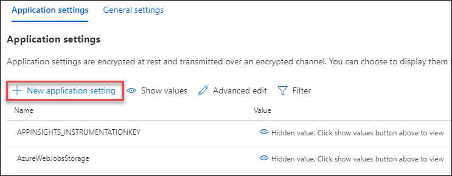

8. Enter **eventHubConnectionString** into the name field, and paste the copied value as the **value** field.  Select the OK button.

    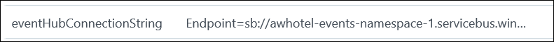

#### Event Hub name

Your event hubs can be found by going to your Event Hub overview blade, and selecting Event Hubs from the left menu.


1. For the **sourceEventHubName** setting in Application Settings, enter the name of your first Event Hub, **awchathub**.

2. For the **destinationEventHubName**, enter the name of your second Event Hub, **awchathub2**.

#### Storage account

Your storage accounts can be found by going to the intelligent-analytics resource group, and selecting the Storage account.

1. For the **storageAccountName** setting in Application Settings, enter the name of the storage account you created.

2. For the **storageAccountKey** enter the Key for the storage account you created (which you can retrieve from the Portal).

    - From your storage account's blade, select Access Keys from the left menu, under Settings.

      

    - Copy the Key value for key1, and paste that into the value for storageAccountKey in the App.Config file.

      

#### Service Bus connection string

The namespace, and therefore connection string, for the service bus is different from the one for the event hub. We need to retrieve the shared access policy to allow the `ChatMessageSentimentProcessorFunction` **ChatConsole** permissions that was created earlier.

1. Navigate to the service bus overview. Choose the Shared Access policies link under Settings. Select the **ChatConsole** from the list of policies and copy the Primary Connection String value.

    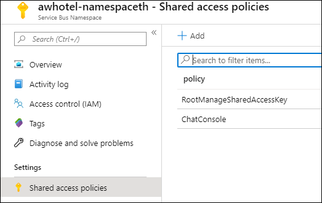

    

2. Return to the Function App's Application Settings and paste this as the value for **serviceBusConnectionString**.

#### Chat topic

1. For the **chatTopicPath** application setting, enter the name of the Service Bus Topic you had created (e.g., awhotel). This can be found under Topics on the Service Bus overview blade.

    

#### Text Analytics API settings

1. In the [Azure portal](https://portal.azure.com), open the Cognitive Service Text API (e.g. awhotels-sentiment). Locate the region the service was created in the Text Analytics Properties menu item.

   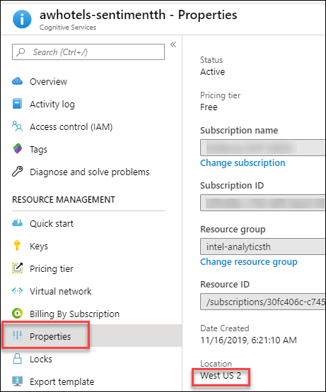

    Enter the region value under Endpoint into the **textAnalyticsBaseUrl** Function App setting. **Use all lower case alpha characters with no spaces.**

    

    The region value will be used in a call to https://westus2.api.cognitive.microsoft.com/text/analytics/v2.1/sentiment in the Function code.

2. On the left-hand menu of the Text API blade, select Keys.

    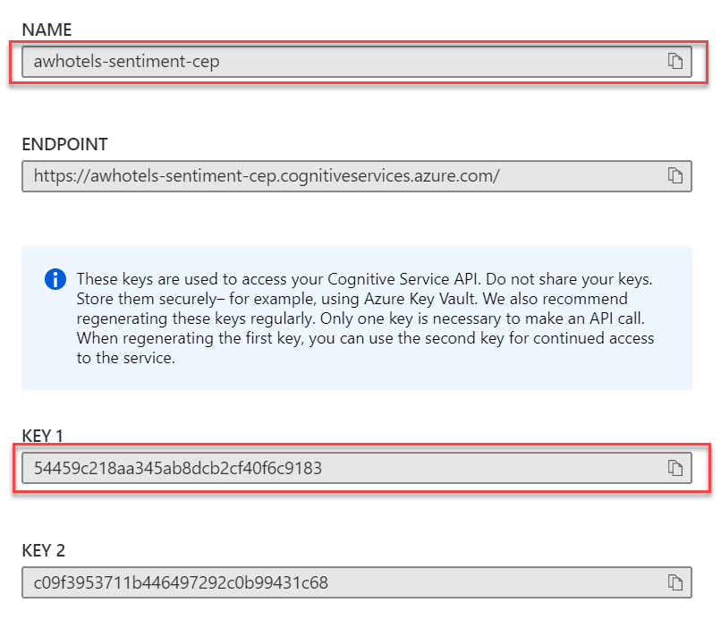

3. Copy the value of **Name** into the value attribute of **textAnalyticsAccountName** in the Function App's Application Settings.

4. Copy the value of **Key 1** from the blade into the value attribute of the **textAnalyticsAccountKey** in the Function App's Application Settings.

5. Scroll to the top of Application Settings and select **Save**. Your application settings should now resemble the following:

    

## Exercise 3: Configure the Chat Web App settings

Duration: 10 minutes

Within Visual Studio Solution Explorer, expand the `ChatWebApp` project and open `Web.Config`. You will update the settings in this file. The following sections walk you through the process of retrieving the values for the following settings:

```csharp
<add key="eventHubConnectionString" value=" "/>
<add key="eventHubName" value=" "/>
<add key="serviceBusConnectionString" value=" "/>
<add key="chatRequestTopicPath" value=" "/>
<add key="chatTopicPath" value=" "/>
```

>**Note**: These will be the same setting values you entered for the Function Application settings.

### Task 1: Event Hub connection String

1. Enter the **eventHubConnectionString**.

### Task 2: Event Hub name

1. For the **eventHubName**, enter the name of your first Event Hub (**awchathub**). This event Hub will receive messages from the website chat clients.

### Task 3: Service Bus connection String

1. Enter the **serviceBusConnectionString**.

### Task 4: Chat topic path and chat request topic path

1. For the **chatRequestTopicPath** and the **chatTopicPath**, enter the name of the Service Bus Topic you created, **awhotel**. The value is the same for both settings in this case.

2. The **web.config** should resemble the following. Select Save in Visual Studio.

    

## Exercise 4: Deploying the App Services

Duration: 15 minutes

With the App Services projects properly configured, you are now ready to deploy them to their pre-created services in Azure.

### Task 1: Publish the ChatMessageSentimentProcessor Function App

1. Within Visual Studio Solution Explorer, right-click the `ChatMessageSentimentProcessorFunction` project in the Solution Explorer, and select **Publish...**

    

2. In the Publish dialog, choose **Select Existing** beneath Azure App Service as the publish target.

    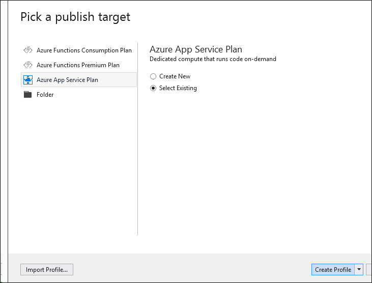

3. Select **Publish**.

4. In the App Service dialog, choose the Subscription that contains your Function App you provisioned earlier. Expand your Resource Group (e.g., **intelligent-analytics**), then select the node for your Function App in the tree view to select it.

    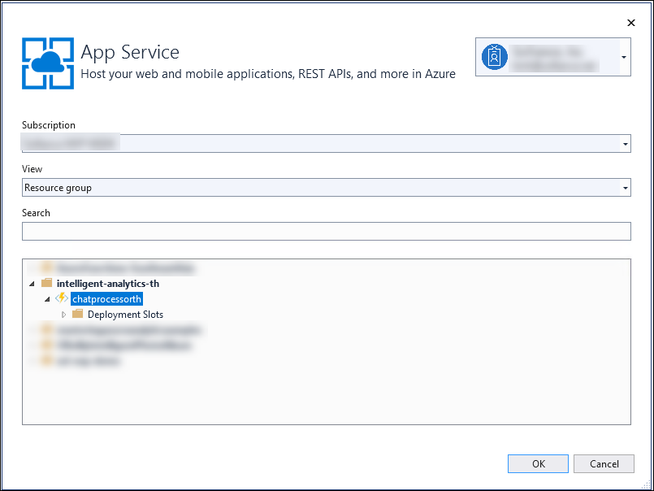

5. Select **OK**.  If asked to update the Azure functions, select the Yes button.

    

6. Select Publish. The publish should immediately begin. If not, select the Publish button on the Publish step.

    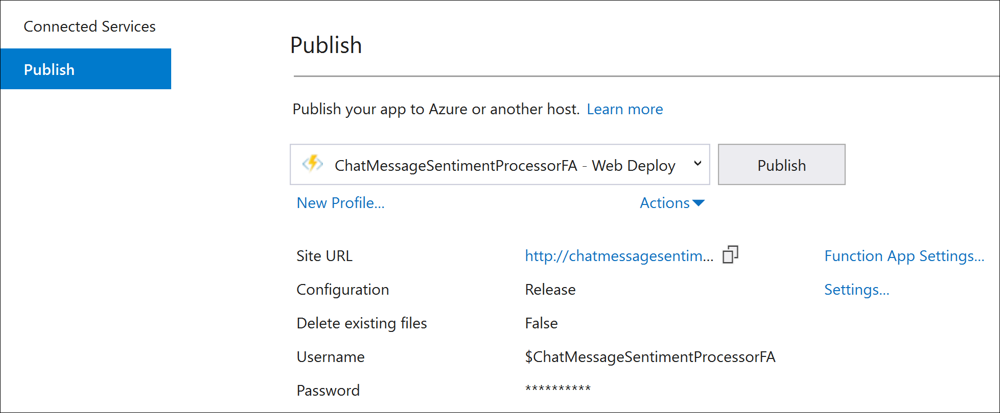

7. When the publish completes, the Output window should indicate success similar to the following:

    

    > **Note**: If you receive an error in the Output window, as a result of the publish process failing (The target "MSDeployPublish" does not exist in the project), expand the Properties folder within the Visual Studio project, then delete the PublishProfiles folder.

8. Repeat steps 1-5 to publish.

### Task 2: Publish the ChatWebApp

1. Within Visual Studio Solution Explorer, right-click the ChatWebApp project and select **Publish...**

    

2. In the Publish blade, select **App Service**, and choose the **Select Existing** radio button. Select **Publish**.

    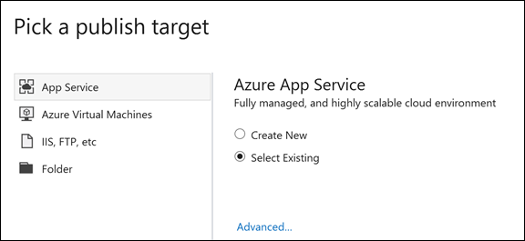

    You may see a different dialog than what is shown above. If so, select Microsoft Azure App Service:

    

3. In the App Service dialog, choose your Subscription that contains your Web App you provisioned earlier. Expand your Resource Group (e.g., **intelligent-analytics**), then select the node for your **Web App** in the tree view to select it.

4. Select **OK**.

5. When the publishing is complete, a browser window should appear with content like the following:

    

    > **Note**: It may take a couple of minutes for the browser to render. You must use a modern browser like Chrome or Edge.

### Task 3: Testing hotel lobby chat

1. Open a browser instance (Chrome is recommended for this web app), and navigate to the deployment URL for your Web App.

    - If you are unsure what this URL is, it can be found in two places:

      - First, you can find it on the ChatWebApp document in Visual Studio, that was opened when you published the Web App 

        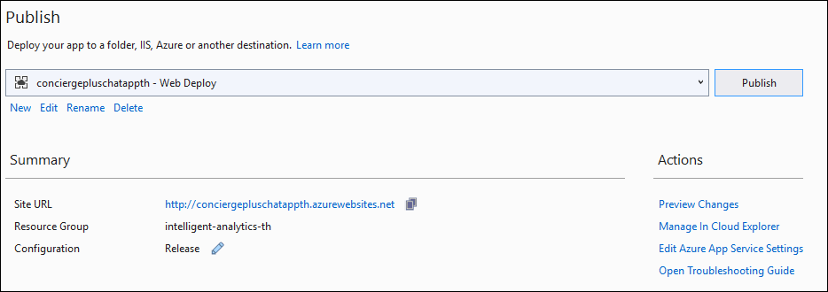

      - Alternatively, this can be found in the [Azure portal](https://portal.azure.com) on the Overview blade for your Web App.

2. Under the Join Chat area, enter your username (anything will do).

3. Leave Hotel Lobby selected.

4. Select **Join**.

    

5. The Live Chat should appear. (Notice it auto-announced you joining to the room; this is the first message. Note, this may take a few seconds to appear.)

    

6. Open another browser instance (You could try this from your mobile device).

7. Enter another username, and Select Join.

8. From either session, fill in the Chat text box and select Send. You can try using @ and \# too, just to seed some text for search.

    

9. You can join with as many sessions as you want (The Hotel Lobby is basically a public chat room).

    >**Debugging Tips**: If you don't see your messages showing up in the Live Chat window, double check your Azure Event Hub activity. Open the Metrics screen. Make sure incoming and outgoing messages are being processed.  Validate the WebChat web.config values match your Azure service configurations exactly. Also, if you navigate to the Azure Function Monitor, you can get more clues to any problems. Below is example of the log output. It can take up to 5 minutes for log entries to display.

    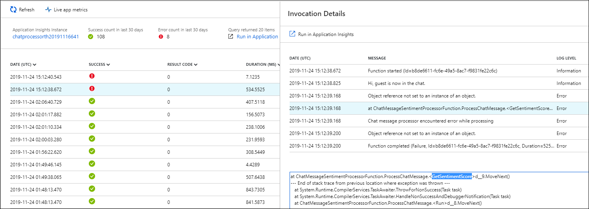

## Exercise 5: Add intelligence

Duration: 60 minutes

In this exercise, you will implement code to activate multiple cognitive intelligence services that act on the chat messages.

### Task 1: Implement sentiment analysis

In this task, you will add code that enables the Event Processor to invoke the Text Analytics API using the REST API and retrieve a sentiment score (a value between 0.0, negative, and 1.0, positive sentiment) for the text of a chat message.

1. In the Solution Explorer in Visual Studio, open `ProcessChatMessage.cs` in the `ChatMessageSentimentProcessorFunction` project.

2. Scroll down to the method **Run**.

3. Replace the code following TODO: 7 with the following:

    ```csharp
    //TODO: 7.Configure the HTTPClient base URL and request headers
    _sentimentClient.DefaultRequestHeaders.Clear();
    _sentimentClient.DefaultRequestHeaders.Accept.Clear();
    _sentimentClient.DefaultRequestHeaders.Add("Ocp-Apim-Subscription-Key", _textAnalyticsAccountKey);
    _sentimentClient.DefaultRequestHeaders.Accept.Add(new MediaTypeWithQualityHeaderValue("application/json"));
    ```

4. Scroll down to the `GetSentimentScore` method and replace the code following TODO: 8 with the following:

    ```csharp
    //TODO: 8.Construct a sentiment request object
    var req = new SentimentRequest()
    {
        documents = new SentimentDocument[]
        {
            new SentimentDocument() { id = "1", text = messageText, language = "en" }
        }
    };
    ```

5. Replace the code following TODO: 9 with the following:

    ```csharp
    //TODO: 9.Serialize the request object to a JSON encoded in a byte array
    var jsonReq = JsonConvert.SerializeObject(req);
    byte[] byteData = Encoding.UTF8.GetBytes(jsonReq);
    ```

6. Replace the code following TODO: 10 with the following:

    ```csharp
    //TODO: 10.Post the request to the /sentiment endpoint
    // You need to enter the region.
    string uri = $"https://{_textAnalyticsBaseUrl}.api.cognitive.microsoft.com/text/analytics/v2.1/sentiment";
    string jsonResponse = "";
    using (var content = new ByteArrayContent(byteData))
    {
        content.Headers.ContentType = new MediaTypeHeaderValue("application/json");
        var sentimentResponse = await _sentimentClient.PostAsync(uri, content);
        jsonResponse = await sentimentResponse.Content.ReadAsStringAsync();
    }
    Console.WriteLine("\nDetect sentiment response:\n" + jsonResponse);
    ```

7. Replace the code following TODO: 11 with the following:

    ```csharp
    //TODO: 11.Deserialize sentiment response and extract the score
    var result = JsonConvert.DeserializeObject<SentimentResponse>(jsonResponse);
    sentimentScore = result.documents[0].score;
    ```

8. Navigate to the Run method and replace the line following TODO: 12 with the following code:

    ```csharp
    //TODO: 12 Append sentiment score to chat message object
    msgObj.score = await GetSentimentScore(msgObj.message);
    log.Info("SentimentScore: " + msgObj.score);
    ```

### Task 2: Implement linguistic understanding

In this task, you will create a LUIS app, publish it, and then enable the Event Processor to invoke LUIS using the REST API.

1. Using a browser, navigate to <http://www.luis.ai>.  

    >**Note**: If in Exercise 1, Step 12 you created your Luis account in Azure in an European region (e.g. West Europe), user <http://eu.luis.ai> instead. If you selected an Australian region use <http://au.luis.ai>.

2. Select **Sign in** **or create an account**.

    

3. Sign in using your Microsoft account (or \@Microsoft.com account if that is appropriate to you). The new account startup process may take a few minutes.

4. Select **Accept**.

    

5. You should be redirected to the LUIS Welcome page at <https://www.luis.ai/welcome>. Scroll down and select **Create LUIS app**.

    

6. Complete the additional info and terms of use form and select **Continue**.

    

7. Under My Apps, select **Create New App**.

8. Complete the Create a new app form by providing a name for your LUIS app, the culture and select **Done**.

    

9. In a moment, your new app will appear. Select the app to see the details.

10. In the menu bar, select **Train** and then **Publish**.

    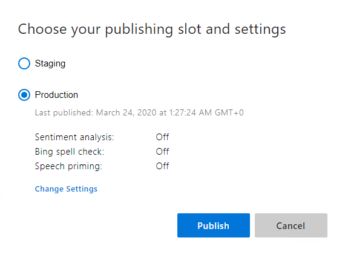

    You should see a success message at the top of the screen.

11. Select My Apps from the menu bar and choose your app from the list.

12. Choose the top **Build** menu. Select **Create new intent**.

    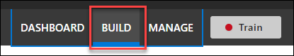

13. In the Intents dialog, for the Intent Name enter **OrderIn** and select **Done**.

    

14. Select Entities from the menu on the left.

    

15. Select Create new entity.

    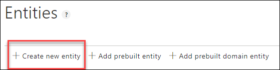

16. For the Entity name specify "**RoomService**" and set the Entity Type to **Simple**.

    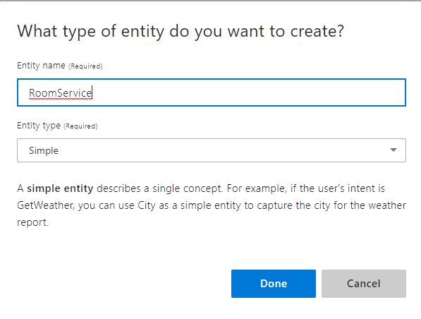

17. Select the newly created **RoomService** entity.

18. Add a new role.

    - Enter **FoodItem** and hit the Enter key.
  
19. Repeat the same steps for Housekeeping entity and RoomItem role.

    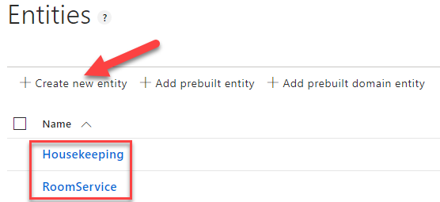

20. Select **Intents** from the menu on the left and select the **OrderIn** intent you created.

    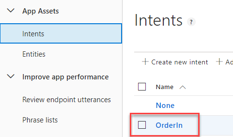

21. Enter an utterance for this intent and match it with an entity and role.

    

22. In the pizza utterance, select the word pizza so it becomes highlighted.  Under Entities select **RoomService**, then select **FoodItem**.

    ![In the Utterances (1) section, order a [pizza] is selected, and below that, RoomService displays with a chevron next to it.](media/2019-06-21-06-44-45.png "Utterances order a pizza")

23. Type a new utterance in the text box.  

    

    Enter the following utterance:

    - Utterance: **bring me toothpaste**

    - Text to select: **toothpaste**

    - Entity: **RoomService:RoomItem**

24. Repeat this process for the following phrases (text to select is in bold):

    - **Bring me towels \| RoomService:RoomItem**

    - **Bring me blankets \| RoomService:RoomItem**

    - **Order a soda \| RoomService:FoodItem**

    - **Order me a hamburger \| RoomService:FoodItem**

      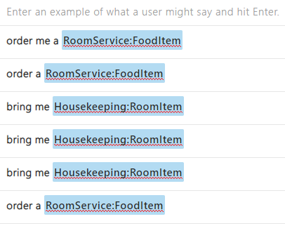

25. Select Train from the menu bar.

    

26. Choose Test and experiment by writing some utterances and pressing enter to see the interpretation.

    

27. Select Publish App from the menu on the top.

28. When the publish completes, Refer to Keys and Endpoints under Manage in menu bar for Endpoint URL.

    

29. This will open a new tab in your browser. Modify the end of the URL (the text following q= ) so it contains the phrase "bring me towels," and press ENTER. You should receive output similar to the following. Observe that it correctly identified the intent as OrderIn (in this case with a confidence of 0.9999995 or nearly 100%) and the entity as pizza having an entity type of Housekeeping:RoomItem (in this case with a confidence score of 96.9%).

    

30. In the URL, take note of three things:

    - The LUIS base URL, _highlighted_. Copy this value, and paste it into a text editor, such as Notepad, for later reference.
  
    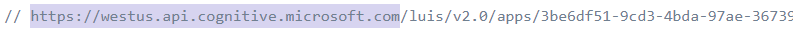

    - The GUID following apps/GUID/, _highlighted_. This is your App ID and you will need to use it in configuration later. It looks like the following:

    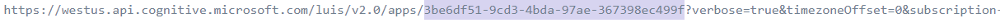

      You can also find your App ID by going to the **Application Settings** tab.

    - The subscription-key value is the luis-api key value.

31. You can add more utterances as desired by repeating the above steps to add new utterances, indicate the entity, train the model, and then update the publish application using the button in the Publish App screen.

32. When you are ready to integrate LUIS into your app, go to the Manage option in menu bar, and locate the luis key under Resources and Keys. Copy the Key String. Paste this to your notepad.

    

33. You will enter this into the configuration of the Event Processor Function App.

34. Select the Configuration link. Navigate to the Application Settings for your Event Processor Function App in the [Azure portal](https://portal.azure.com).

35. Set the LUIS Application Settings.
- For the key **luisAppId** set the text of the value attribute to the App ID of your LUIS App (this value should be a GUID you obtained from the URL and not the name of your LUIS app).
- For the key **luisKey**, set the text of the value attribute to the subscription key used by your LUIS app.
- Set the **luisBaseUrl** to the LUIS base URL captured earlier.

    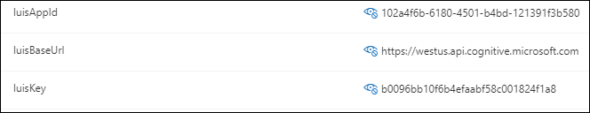

36. **Save** your Application Settings. The Event Processor is pre-configured to invoke the LUIS API using the provided App ID and key.

37. Open Visual Studio then open `ProcessChatMessage.cs` within the `ChatMessageSentimentProcessorFunction` project, and navigate to the Run method.

38. Locate TODO: 14 and replace it with the following:

    ```csharp
    //TODO: 14.Respond to chat message intent if appropriate
    var intent = await GetIntentAndEntities(msgObj.message);
    await HandleIntent(intent, msgObj, outputServiceBus);
    ```

39. Take a look at the implementation of both methods if you are curious how the entity and intent information is used to generate an automatic chat message response from a bot.

40. Save the file.

### Task 3: Re-deploy and test

Now that you have added sentiment analysis and language understanding to the solution, you need to re-deploy the apps so you can test out the new functionality.

1. Publish the `ChatMessageSentimentProcessorFunction` Function App using Visual Studio just as you did in [Exercise 1, Task 1](#task-1-publish-the-chatmessagesentimentprocessor-function-app).

2. Publish the `ChatWebApp` just as you did in [Exercise 1, Task 2](#task-2-publish-the-chatwebapp).

3. Join a chat with the Hotel Lobby.

4. Type a message with a positive sentiment, like "I love this weather." Observe the "thumbs-up" icon that appears next to the chat message you sent. Next, types something like, "This weather is terrible," and observe the thumbs-down icon. These are indicators of sentiment (as applied by your solution in real-time).

    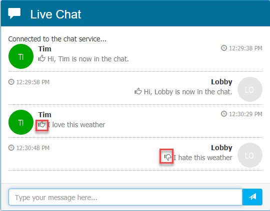

5. Next, try ordering some items from room service, like "bring me towels" and "order a pizza." Observe that you get a response from the ConciergeBot, and that the reply indicates whether your request was sent to Housekeeping or Room Service, depending on whether the item ordered was a room or food item.

    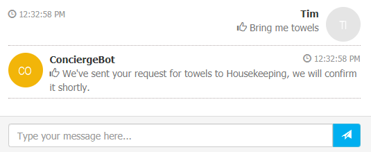

## Exercise 6: Create Logic App for sending SMS notifications

Duration: 30 minutes

In this exercise, you will create a Logic App for sending SMS or email messages. The Logic App will be triggered when messages are added to a Service Bus Queue. The Logic App will use a Twilio connector to send SMS messages.

### Task 1: Create Free Twilio account

In this task, you will create a free Twilio account that will be used to send SMS notifications.

1. If you do not have a Twilio account, sign up for one for free at by going to <https://www.twilio.com/try-twilio>.

2. On the **Sign up for free** page:

    - Enter your personal info, email address, and a 14+ character password.

    - Select SMS under **Which product do you plan to use first?**

    - Select **Order Notifications** under **What are you building?**

    - Select **JavaScript** under **Choose your language**.

    - Select **Not a Production App** under **Potential monthly interactions**.

    - Check the box next to **I'm not a robot**.

    - Select **Get Started**.

        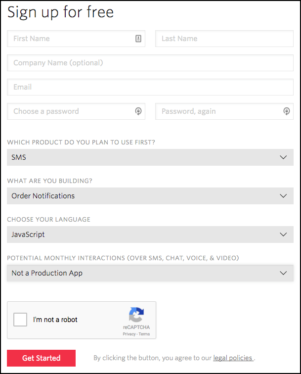

3. Enter your **cell phone number** on the We need to verify you're a human screen, check the box if you do not wish to be contacted at the number you enter, and select **Verify** via SMS.

    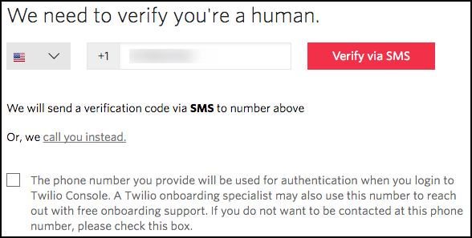

4. Enter the verification code received via text into the box and select **Submit**.

    

5. From your account dashboard, select the **All Products & Services icon**.

    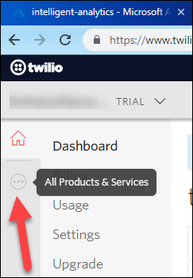

6. Select **#Phone Numbers** under **Super Network**.

    

7. Select **Get Started**.

    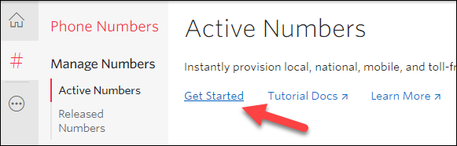

8. Select **Get your first Twilio phone number**.

    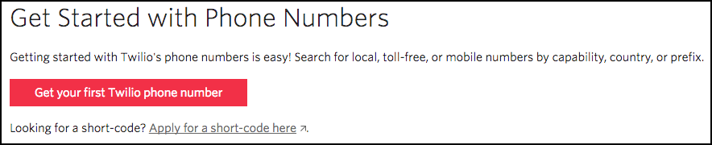

9. Select **Choose this Number** (or search for a different number if you want something different).

    

10. Select **Done** on the Congratulations dialog.

    

11. Select **Home** on your **Account Dashboard**, and leave this page up, as you will be referencing the **Account SID** and **Auth Token** in the next task to configure the Twilio Connector.

    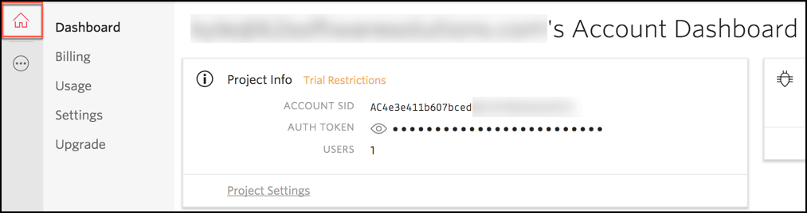

### Task 2: Provision Logic App

In this task, you will create a new Logic App, which will use the Twilio connector to send SMS notifications to hotel guest services employees.

1. In the [Azure portal](https://portal.azure.com), select **+Create a resource**, enter "logic app" into the Search the Marketplace box, select **Logic App** from the results, and then select **Create**.

    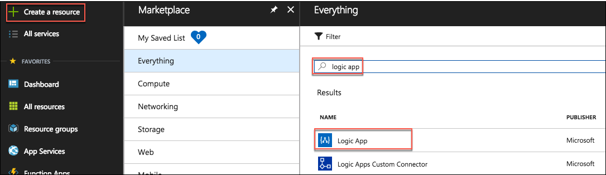

2. In the **Create logic app** blade, enter the following:

    - **Name**: Enter awt-notifications.

    - **Subscription**: Select the subscription you are using for this hands-on lab.

    - **Resource group**: Select **Use existing** and choose the **hands-on-lab-SUFFIX** resource group.

    - **Location**: Select the location you are using for resources in this hands-on lab.

    - **Log Analytics**: Select Off.

        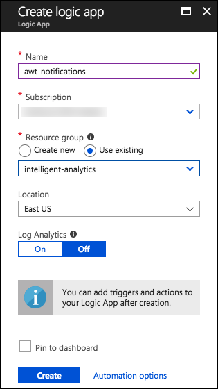

3. Select **Create** to provision the new Logic App.

### Task 3: Configure staff notifications

In this task, you will configure a Logic App to send notifications to hotel guess services employees when a guest is determined to be upset by their Sentiment Analysis score.

1. In the [Azure portal](https://portal.azure.com), navigate to your newly created Logic App, then select **Logic App Designer** under **Development Tools** on the left-hand menu.

    

2. In the **Logic App Designer**, scroll down to the templates, select **Blank Logic App** under **Templates**.

    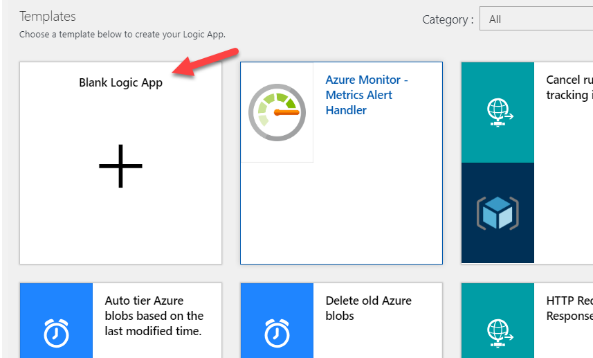

3. Select **Service Bus** under **Connectors**.

    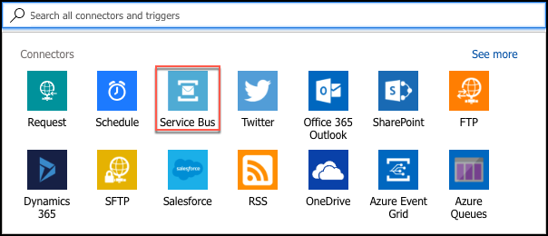

4. Select **Service Bus - When a message is received in a queue (auto-complete)**.

    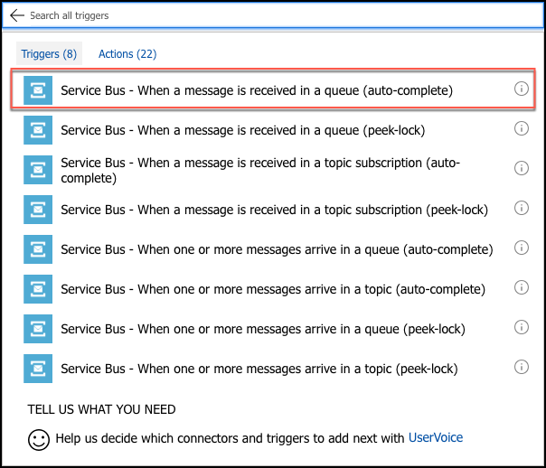

5. On the When a message is received in a queue (auto-complete) dialog, select the **awhotelstaffnotifications** queue from the Queue name drop down.
    >**Note**: Remember the **awhotelstaffnotifications** queue you set up earlier in the awhotel Service Bus.

    

    - Enter the **awhotelstaffnotifications** into the connection name input box.
    - Double select the **awhotel** namespace entry. e.g. awhotel-namepsace-th
    - Select the **ChatConsole** service bus policy.
    - Select the **Create** button.

    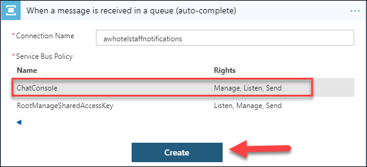

    - Enter 1 minute interval.

    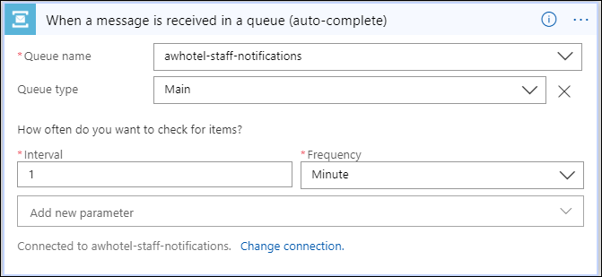

    - Save your configuration.

    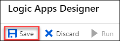

6. Select **+ New step**.

    

7. In the Choose an action pane, search for Data Operations, select **Parse JSON** from the list.

    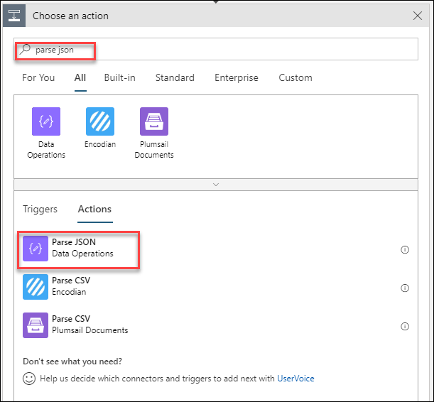

8. In the **Parse JSON** pane, paste the following expression into the **Content** box:

    ```csharp
    @substring(base64ToString(triggerBody()?['ContentData']), indexof(base64ToString(triggerBody()?['ContentData']), '{'), sub(lastindexof(base64ToString(triggerBody()?['ContentData']), '}'),indexof(base64ToString(triggerBody()?['ContentData']), '{')))
    ```

    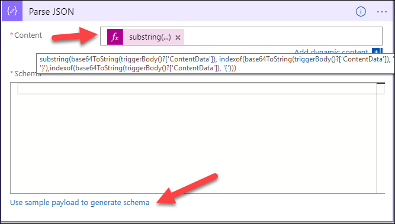


9. Select **Use sample payload to generate schema**, and on the Enter or paste a sample JSON payload dialog, paste the following JSON sample, and then select **Done**.

    ```json
    {
        "message": "this hotel is horrible",
        "createDate": "2018-06-26T15:01:48.4925693Z",
        "username": "kyle",
        "sessionId": "hotellobby",
        "messageId": "7f180d06-c4ac-40c5-8539-1de4218afcd0",
        "score": 0.0019252896308898926,
        "EventProcessedUtcTime": "2018-06-26T15:01:49.7819289Z",
        "PartitionId": 24,
        "EventEnqueuedUtcTime": "2018-06-26T15:01:49.6440000Z"
    }
    ```

    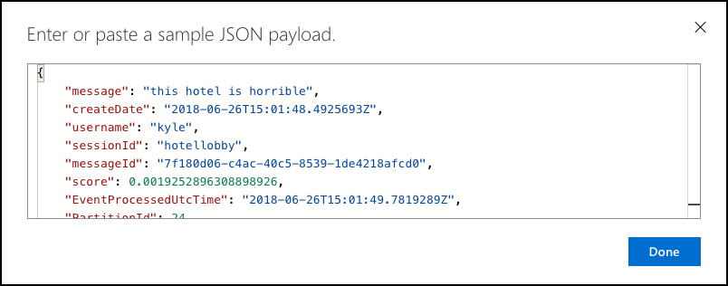

10. The Schema box in the Parse JSON pane will now be populated with a reformatted Schema.

11. Select **+ New step** button.

12. In the Choose an action pane, enter "Twilio" into the search box, and then select **Twilio - Send Text Message (SMS)** under Actions.

    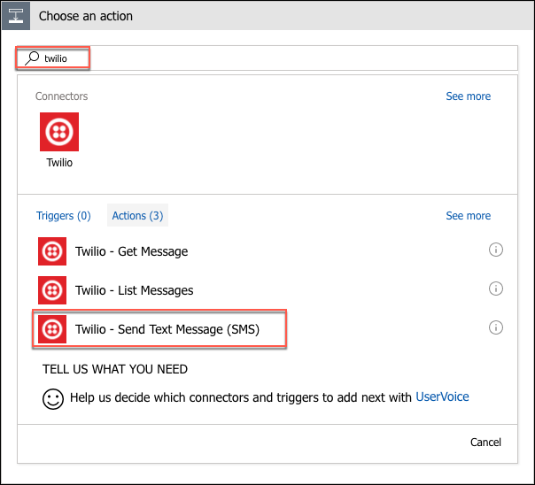

13. In the **Twilio -- Send Text Message (SMS)** dialog, enter the following (You will need the details from Project Info block on the dashboard of your Twilio account for this step):

    - **Connection Name**: Twilio

    - **Twilio Account Id**: Enter your Twilio account SID.

    - **Twilio Access Token**: Enter your Twilio auth token.

         dialog box")

14. Select **Create**.

15. On the next **Send Text Message (SMS)** dialog, enter the following:

    - **From Phone Number**: Select your Twilio phone number from the drop down.

    - **To Phone Number**: For this hands-on lab, you will enter your mobile phone number into this field. In a real-world app, you would most likely add another step into the Logic App to retrieve the target phone number from a database.

    - **Text**: Enter a message, such as "Guest [Name] appears to be upset in the hotel chat. This requires your immediate attention!" For [Name], select the **username** parameter from the **Dynamic content** items.
  
        Enter "Guest " + (username) + " seems upset in the hotel chat.  This requires your immediate attention!"

         dialog box")

16. Select **Save** on the **Logic Apps Designer** toolbar.

    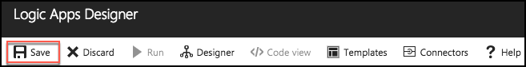

17. The Logic App will begin running immediately, so you should receive a text message on your phone within a minute or two of selecting Save, if there are messages already in the queue.

### Task 4: Add negative chat messages to trigger staff notifications

In this task, you will add messages to the chat containing negative sentiment to trigger notification messages through the Logic App.

1. Return to the chat application in your web browser, enter a username, and select **Join**.

    

2. Enter a message with negative sentiment, such as "The service at this hotel is horrible!" and send the message.

    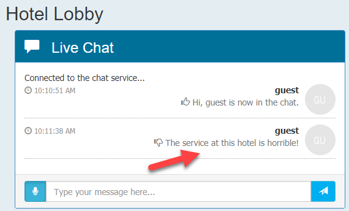

3. Within a minute, you should receive a text notification at the phone number you specified when configuring the Logic App.

    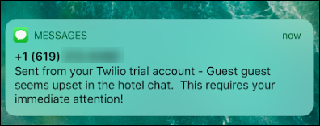

4. Test sending a "positive" message, and ensure you don't receive a notification.

## Exercise 7: Building the Power BI dashboard

Duration: 30 minutes

Now that you have the solution deployed and exchanging messages, you can build a Power BI dashboard that monitors the sentiments of the messages being exchanged in real time. The following steps walk through the creation of the dashboard.

### Task 1: Provision Power BI

If you do not already have a Power BI account:

1. Go to <https://powerbi.microsoft.com/features/>.

2. Scroll down until you see the Try Power BI for free! section of the page, and select the Try Free\> button.

    

3. On the page, enter your work email address (which should be the same account as the one you use for your Azure subscription), and select Sign up.

    

4. Follow the on-screen prompts, and your Power BI environment should be ready within minutes. You can always return to it via <https://app.powerbi.com/>.

### Task 2: Create the static dashboard

1. Sign in to your Power BI subscription (<https://app.powerbi.com>).

2. Select My Workspace on the left-hand menu, the select the Datasets tab.

    

3. Under the **Datasets** list, select the **Messages** dataset. Search for the Messages dataset, if there a too many items in the dataset list.

    

4. Select the **Create Report** button under the Actions column.

    

5. On the Visualizations palette, select **Gauge** to create a semi-circular gauge.

    

6. In the Fields listing, select and drag the **score** field and drop it onto the **Value** field.

    

7. Select the drop-down menu that appears where you dropped score and select **Average**.

    

8. You now should have a gauge that shows the average sentiment for all the data collected so far, which should look similar to the following:

    

9. From the File menu, select Save to save your visualization to a new report.

    

10. Enter **ChatSentiment** for the report name, and select **Save**.

    

### Task 3: Create the real-time dashboard

This gauge is currently a static visualization. You will use the report just created to seed a dashboard whose visualizations update as new messages arrive.

1. Select the Pin Live Page icon located near the top right of the Gauge control.

    

2. Select New **dashboard**, enter **Real-time Sentiment** as the name, and select **Pin**.

    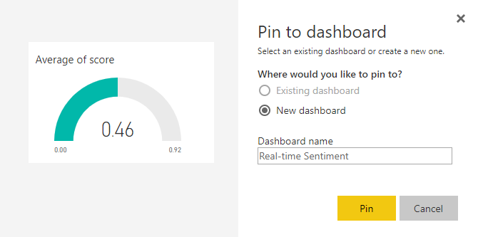

3. Return to the **My Workspace** page, and select your newly created dashboard from the list of dashboards.

    

4. Real-time dashboards are created in Power BI using the Q&A feature, by typing in a question to visualize in the space provided. In the "Ask a question about your data" field, enter: "average score created between yesterday and today".

    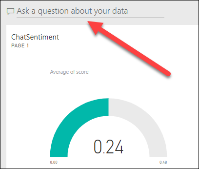

    

5. Next, convert this to a Gauge chart by expanding the Visualizations palette at right, and clicking on the Gauge control.

    

6. Format the Gauge control so it ranges between 0.0 and 1.0 and has an indicator at 0.5. To do this, select the brush icon in the Visualization palette, expand the Gauge axis, and for Min enter 0, Max enter 1, and Target enter 0.5.

    

7. Your gauge should now look similar to the following:

    

8. In the top-right corner, select **Pin visual**.

    

9. In the dialog that appears, select the dashboard you recently created and select **Pin**.

    

10. In the list of dashboards, select your Real-time Sentiment dashboard. Your new gauge should appear next to your original gauge. If the original gauge fills the whole screen, you may need to scroll down to see the new gauge. You can delete the original gauge if you prefer. (Select the top of the visualization, then ellipses that appear, and then, the trash can icon.)

    

11. Navigate to the chat website you deployed and send some messages and observe how the sentiment gauge updates with moments of you sending chat messages.

### Task 4: Add a trending sentiment chart to the dashboard

The sentiment visualization you created is great for getting a sense of sentiment as of this moment. However, First Up Consultants wishes to view sentiment over time for historical reference and to see whether overall sentiment is trending one way or another. To do this, we will use the tumbling window query output from Stream Analytics to display this data in a line chart.

1. While still in Power BI, select **My Workspace** once again, then select the Datasets tab. Search for "Trending". You should see the **TrendingSentiment** dataset dynamically created by Stream Analytics. Select the Create Report action.

    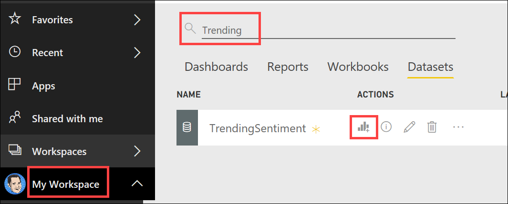

2. Select the **Line chart** visualization.

    

3. Drag the **average** field to the **Values** setting, and **snapshot** to **Axis**.

    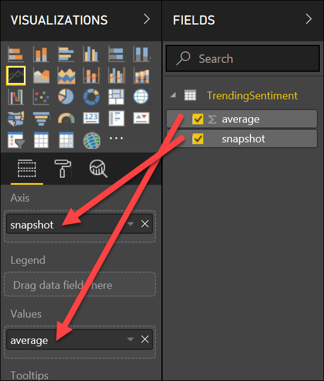

4. Resize the line chart and observe how the average sentiment is tracked over time.

    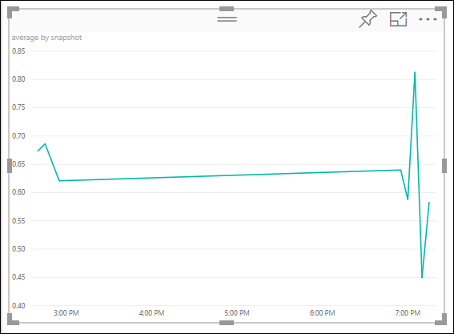

5. Select **Save this report** on the top of the page. Name the report "Trending Sentiment" when prompted..

    

6. Next, select **Pin Live Page**.

    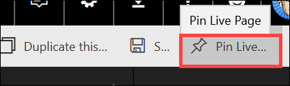

7. In the Pin to dashboard dialog, select **Existing dashboard**, select the dashboard you created previously, then select **Pin live**.

    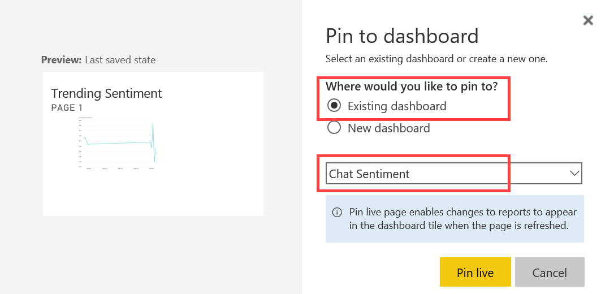

8. Position the Trending Sentiment line chart beneath the average score gauge.

    

9. Try building out the rest of the real-time dashboard that should look as follows. We provide the following Q&A questions you can use to get started.

    

    - Count of Messages (Card visualization): Count of messages between yesterday and today.

    - Count of Messages by Username (Pie chart visualization): Count of messages by username between yesterday and today.

    - Upset Users (Bar chart visualization): Average score by username between yesterday and today.

10. Invite some peers to chat and monitor the sentiments using your new, real-time dashboard.

## Exercise 8: Enabling search indexing

Duration: 30 minutes

Now that you have primed the system with some messages, you will create a Search Index and an Indexer in Azure Search upon the messages that are collected in Azure Cosmos DB.

### Task 1: Verifying message archival

Before going further, a good thing to check is whether messages are being written to Azure Cosmos DB from the Stream Analytics Job.

1. In the Azure Portal, navigate to your **Azure Cosmos DB account**.

2. On the left-hand menu, select **Data Explorer**.

    

3. Under the **awhotels** Cosmos DB, select **messagestore**, then **Items**. You should see some data here.

    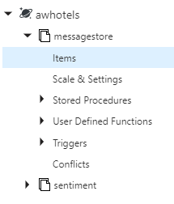

4. If you want to peek at the message contents, select any item in the listing.

    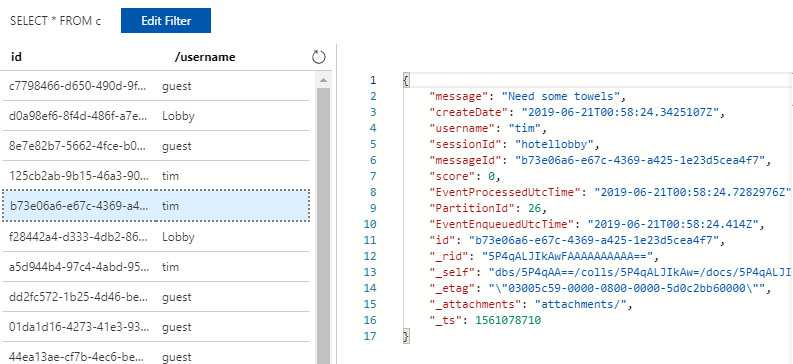

    >**Note**: If you don't see messages, then check for errors in MessageLogger, Outputs, Cosmos DB.  If you have to delete the collection and recreate them, make sure to stop and start the MessageLogger.  Test the connection. 

    

### Task 2: Creating the index and indexer

1. Select Resource Groups from the left menu, then select the **intelligent-analytics** resource group.

2. Select your **Search** **service** instance from the list.

    

3. Select **Import data**.

    

4. On the Import data blade, select **Connect to your data**.

    

5. Select **Cosmos DB** from the dropdown.

6. Enter **messagestore** for the name of the Data Source.

7. **Cosmo DB account**: Enter your account connection string.

    >Note: You find your connection string here:

    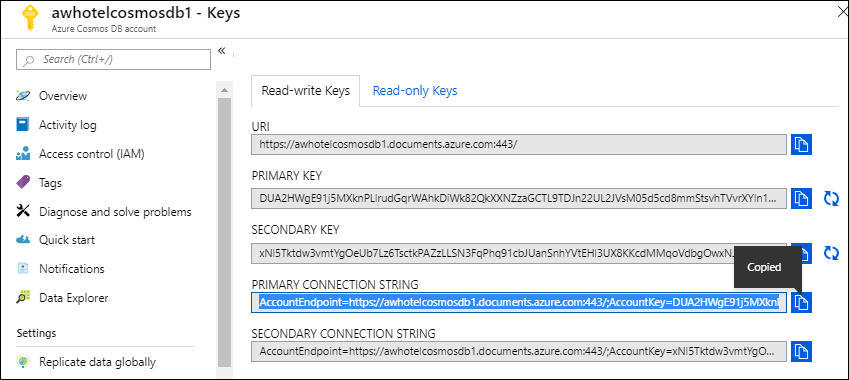

8. Choose your **awhotels** database.

9. Choose your **messagestore** collection.

    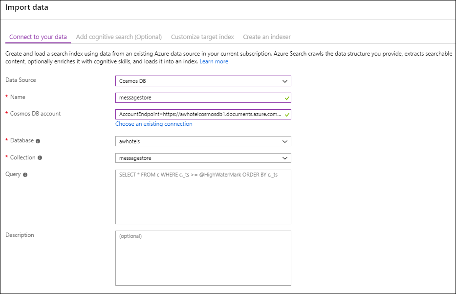

10. Select the **Next** button.

    

    Select **Skip to Customize target index**

    

11. Select **Customize target index**, and observe that the field list has been pre-populated for you based on data in the collection.

12. Enter **chatmessages** for the name of the index.

13. Leave the Key set to id.

    

14. Select the Retrievable check box for the following fields: **message, createDate**, **and username** (id will be selected automatically). Only these fields will be returned in query results.

15. Select the Filterable check box for **createDate, username**, **and sessionId**. These fields can be used with the filter clause only (not used by this Tutorial, but useful to have).

16. Select the Sortable check box for **createDate**, **username**, and **sessionId**. These fields can be used to sort the results of a query.

17. Select the Searchable check box for message. Only these fields are indexed for full text search.

18. Confirm your grid looks similar to the following, and select **Next: Create an Indexer**.

    

19. On the Create an Indexer blade, enter **messages-indexer** as the name.

20. Set the Schedule toggle to **Custom**.

21. Enter an interval of **5** minutes (the minimum allowed).

22. Set the Start time to **today's date**.

23. The description and other fields can be ignored.

24. Select **Submit** to begin importing data using your indexer.

25. You should test your index and configure it to be searchable by client applications. After a few moments, examine the Indexers tile for the status of the Indexer.

    

    You should see your messages indexed.

    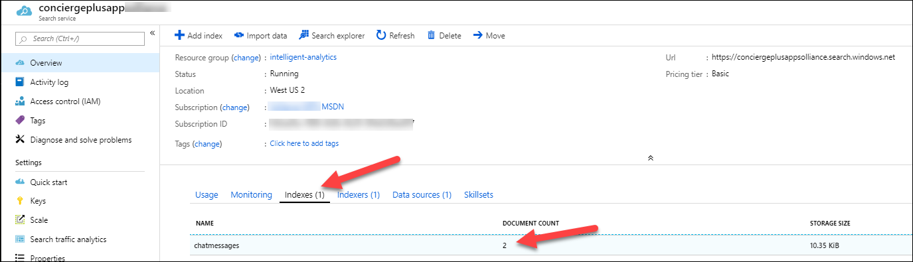

    Select the index name.  You can test the searches by entering values in the **Query string** text box.

    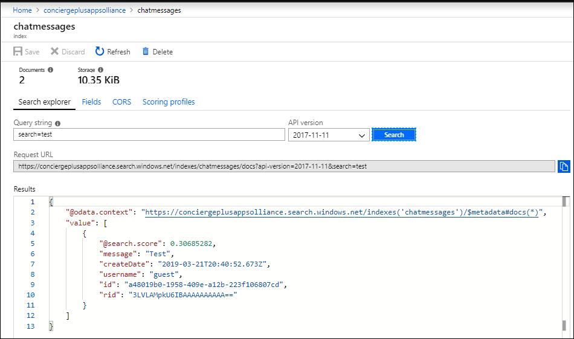

    Select the **CORS** tab. Select **All** for the option. Press the Save button.

    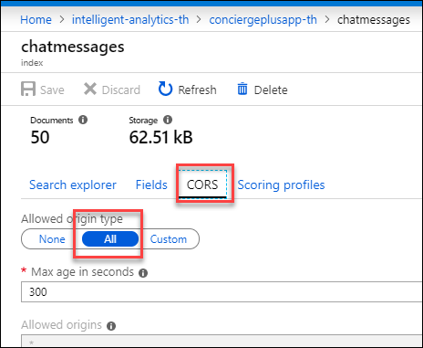

    >**Note**: The **All** setting allows search requests from other client applications to successfully execute. For a production application, you would choose the **Custom** option and enter the domain you will be receiving requests from.

29. We need to capture the index query api key for the web.config files in the Visual Studio solution.
    - On the Search service blade, select Keys on the left-hand menu.

      

    - Select **Manage query keys**.

      

    - On the Manage query keys blade, copy the \<empty\> key value. You don't want to use the admin keys.

      

### Task 3: Update the Chat Web App web.config

1. On your Lab VM, within Visual Studio Solution Explorer, expand the **ChatWebApp** project.

2. Open **Web.config**.

3. For the `chatSearchApiBase` key, enter the URI of the Search App (e.g., <https://conciergeplusappsearchth.search.windows.net)>.

    - You can find this by going to Resource Groups, selecting the **intelligent-analytics** resource group, and selecting your search app service from the list.

    

4. Enter the index values.
   - Copy the URL value, and paste it into the value setting for the **chatSearchApiBase** key.
   - Enter the **chatSearchApiIndexName** value.  e.g. chatmessages
   - Enter the **chatSearchApiKey** value.

    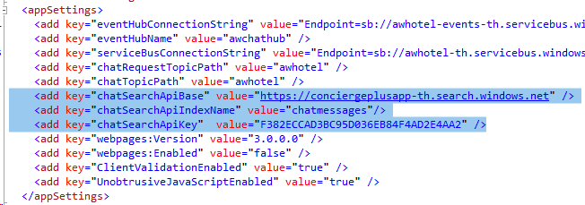

5. Save **Web.config**.

### Task 4: Re-publish web app

1. Publish the updated **ChatWebApp** using Visual Studio, as was shown previously in [Exercise 4, Task 2](#task-2-publish-the-chatwebapp).

2. When the publishing is complete, a browser window should appear.

3. Navigate to the Search tab on the deployed Web App and try searching for chat messages.

    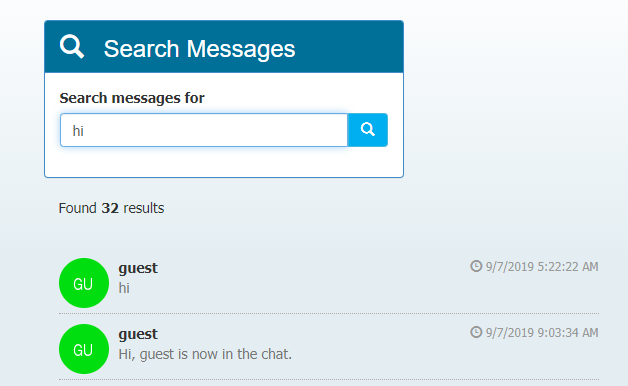

## Exercise 9: Add a bot using Bot service and QnA Maker

Duration: 30 minutes

At this point, you have created a real-time chat service in Azure, allowing people to interact with one another. Now we will build a bot that will automatically respond to user questions, helping take the load off the hotel staff.

### Task 1: Create a QnA service instance in Azure

Microsoft's QnAMaker is a Cognitive Service tool that uses your existing content to build and train a simple question and answer bot that responds to users in a natural, conversational way.

1. In a new web browser window, navigate to <https://www.qnamaker.ai>.

2. On the home page, select **Sign In** on the top of the page. Sign in with the same credentials you use for the [Azure portal](https://portal.azure.com).

    

3. Select **Create a knowledge base**.

    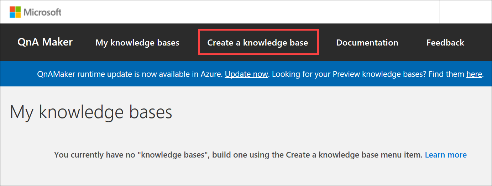

4. Within the knowledge base creation page, select **Create a QnA service** under Step 1.

    

5. Within the Create QnA Maker blade, provide the following:

    - **Name**: Provide a **unique name** for the QnA Maker Service (e.g., awhotel-qna).

    - **Subscription**: Choose the same subscription you used previously.

    - **Management pricing tier**: Choose **F0**.

    - **Resource Group**: Choose the **intelligent-analytics** resource group.

    - **Search pricing tier**: Choose **F**.

    - **Search location**: Choose the **same location** you used previously. If the region you've been using isn't available, select a different location for this resource.

    - **App name**: Provide a **unique name** for the QnA Maker Service (e.g., awhotel-qna).

    - **Website location**: Choose the **same location** you used previously. If the region you've been using isn't available, select a different location for this resource.

    - **App insight**s: Select **Disable**.

    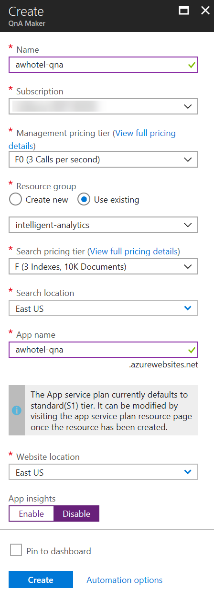

6. Select **Create**.

7. Once the service has been created, switch back to the browser tab with the QnA Maker knowledge base creation page and select the **Refresh** button in the Step 2 section.

8. Underneath Step 2, select your Microsoft Azure Directory ID under which you created the QnA Maker service, select the Azure subscription name, and finally select the **Azure QnA service**.

    

9. Underneath Step 3 (Name your KB), provide a unique name, such as "ConciergePlus".

10. Underneath Step 4 (Populate your KB), select **+ Add file** [Download this file](lab-files/faq.xlsx) and select it from the file browser.

    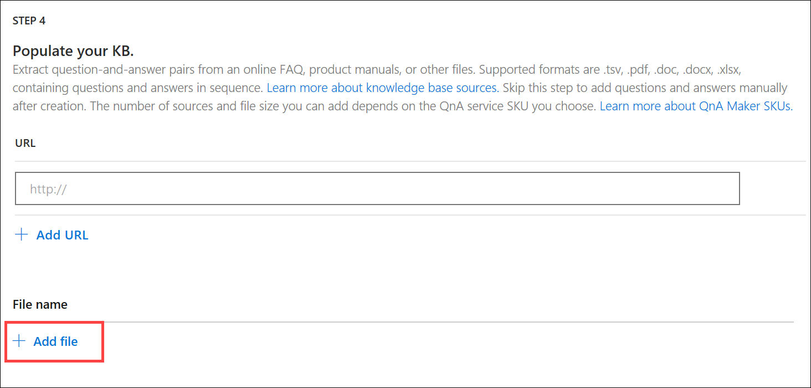

11. Finally, underneath Step 5 (Create your KB), select **Create your KB**.

    

12. When the KB is being created, you will see the popup window. It takes a few minutes for the extraction process to read the Excel document and identify questions and answers.

    

13. Once the KB is successfully created, it opens the 'Knowledge Base' page where you can edit the contents of the knowledge base.

14. Select **Add QnA pair** in the top right to add a new row in the Editorial section of the Knowledge Base. Enter 'Hi' into the 'Question' field and 'Hello. Ask me questions about the hotel.' into the 'Answer' field of the new row you created.

    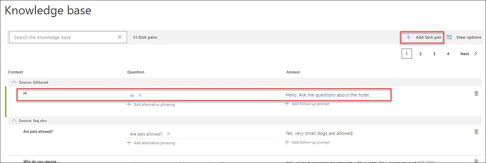

15. Choose **Save and train** button on top of the page. This will save your changes and train the bot how to respond to questions, given the information you imported.

16. Once your changes have been saved, select **Test** at the top of the page. Try typing 'hi there' and press enter. You should see the 'Hello. Ask me questions about the hotel.' response. Experiment with asking different questions.

    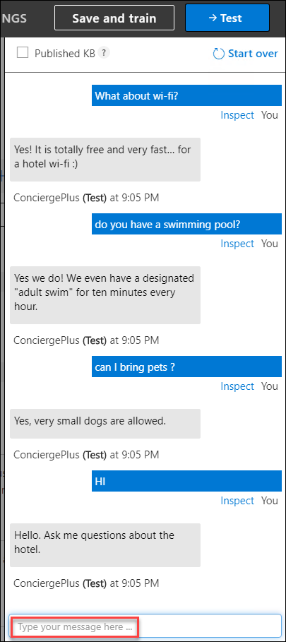

17. Select **Inspect** underneath one of your test questions. The Inspect pane will appear, showing the question you typed, the answer, and a confidence score. This pane provides you an easy way to add alternate phrasing or change the answer. Choose **Save and train**. Select the **Test** button to hide the testing pane.

    

18. Select **Publish** on top of the page. In the publish page that appears, select the **Publish** button.

    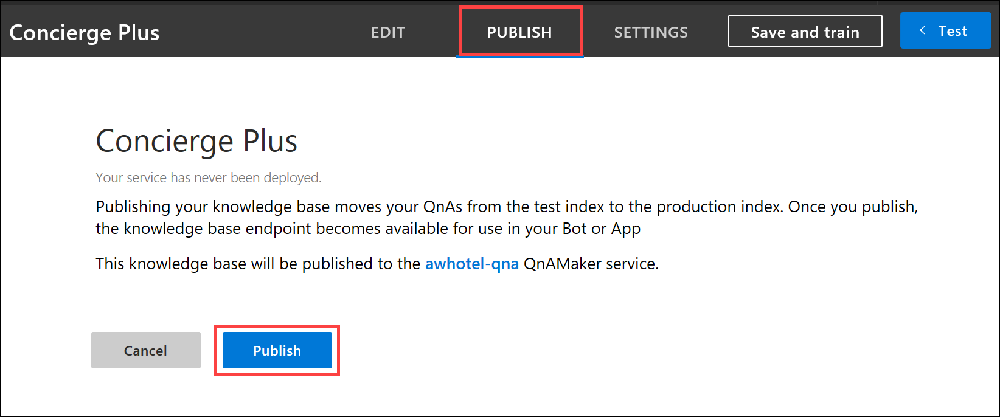


### Task 2: Create a QnA bot

1. Select the **Create Bot** button.

    

2. Enter the Web App Bot configuration.

    - Enter the Bot name.  e.g. awhotel-qna-bot.
    - Select your subscription.
    - Select your resource group.
    - Select your location.
    - Select your pricing tier.
    - Turn Application Insights off.

    >Note: Do not change the QnA Auth Key.

    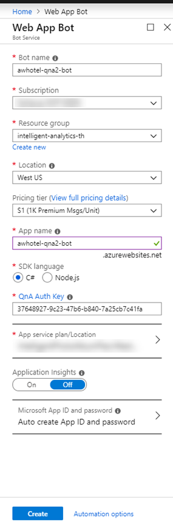

    Select the **Create** button.

3. Choose your new QnA bot from the resource group.

    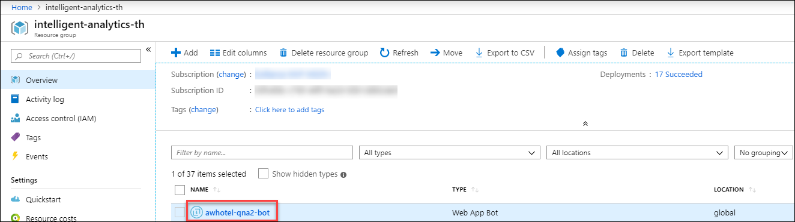

4. Test out the bot by selecting **Test in Web Chat** on the left-hand menu (it may take a couple minutes to appear the first time). Type in a few questions to make sure it responds as expected.

    

5. Select **Settings** from the left-hand menu. Change the display name to something like "Concierge+ Bot", then select **Save**.

    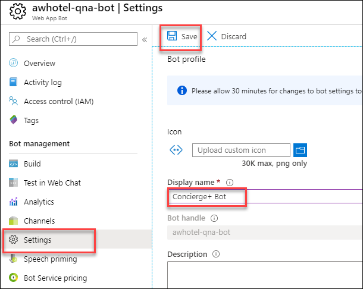

6. Select **Channels** from the left-hand menu, then select **Get bot embed codes** underneath the Web Chat channel.

    

7. A dialog will appear for the embed codes. Select the **Click here to open the Web Chat configuration page** option.

8. Select **Copy** underneath the Embed code. Paste that value to notepad or other text application. Select **Show** underneath the first Secret key. Copy the value and replace YOUR_SECRET_HERE within the embed code with that secret value. Example: `<iframe src='https://webchat.botframework.com/embed/concierge-plus-bot?s=XEYx9upcGtc.cwA.Ku8.hAL6pCxFWfxIjOE9WM48qxkPNtsy4BkT_LST5y0FxEQ'></iframe>`.

    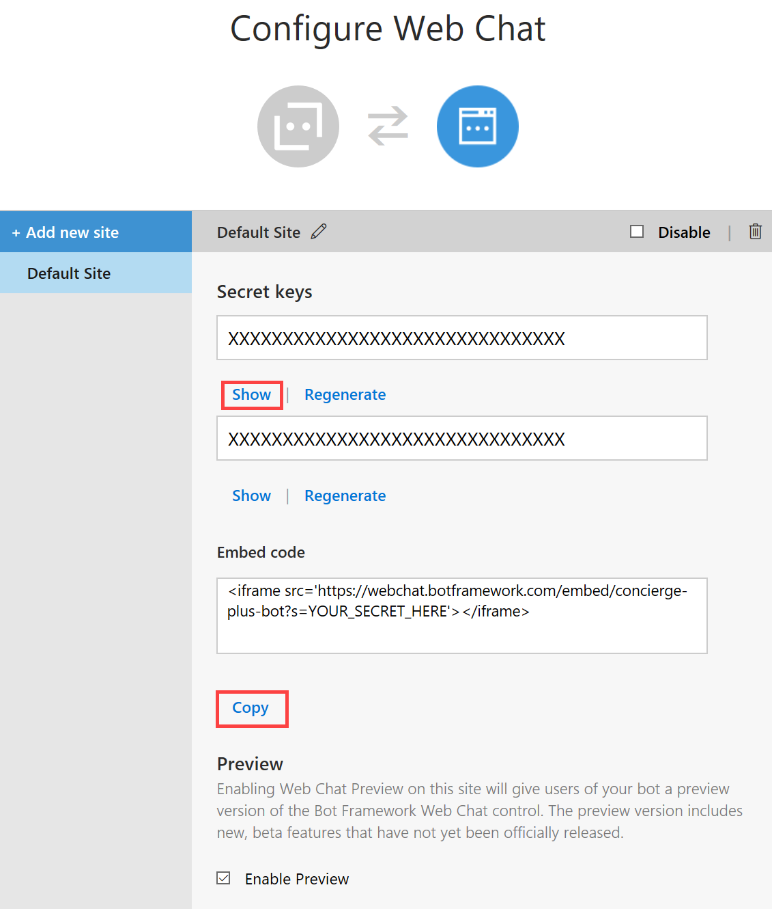

### Task 3: Embed the bot into your web app

1. Open Visual Studio and open **Bot.cshtml** located within the Views\Home folder of the **ChatWebApp**.

    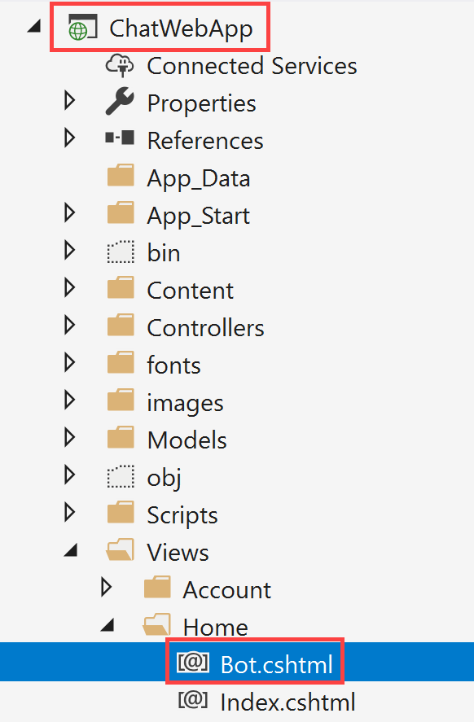

2. Find `<!-- PASTE YOUR BOT EMBED CODE HERE -->` within the page and paste your iframe embed code on a new line beneath.

3. Modify the iframe code to add `width` and `height` values. The iframe code should look like:

    ```html
    <!-- PASTE YOUR BOT EMBED CODE HERE -->
    <iframe width="100%" height="300" src='YOUR_SOURCE'></iframe>
    ```

    

4. **Publish** your web app.

5. After the web app has been published, navigate to it and select the **Bot** menu item. Type in a few questions to ensure the bot is functioning correctly.

    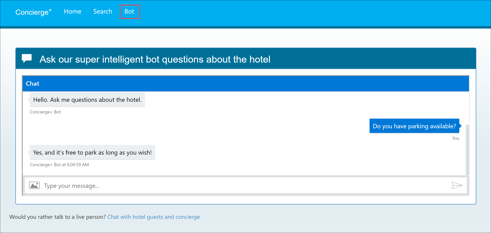

## After the hands-on lab

Duration: 10 mins

In this exercise, attendees will deprovision any Azure resources that were created in support of the lab.

### Task 1: Delete the resource group

1. Using the Azure portal, navigate to the Resource group you used throughout this hands-on lab by selecting Resource groups in the left menu.

2. Search for the name of your research group and select it from the list.

3. Select Delete in the command bar and confirm the deletion by re-typing the Resource group name and selecting Delete.

4. Log into Twilio and release your phone number.

    

5. Power BI - Delete **Real-time Sentiment** workspace.

6. LUIS - https://www.luis.ai/applications.  Delete the **awchat** app.

You should follow all steps provided _after_ attending the Hands-on lab.
